#HTML & CSS: Design and Build Websites

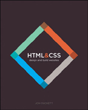

http://www.htmlandcssbook.com/code-samples/
http://www.htmlandcssbook.com/extras/

##1. STRUCTURE

###HOW PAGES USE STRUCTURE
Think about the stories you read in a newspaper: for each story, there will be a headline, some text, and possibly some images. If the article is a long piece, there may be subheadings that split the story into separate sections or quotes from those involved. Structure helps readers understand the stories in the newspaper.

The structure is very similar when a news story is viewed online (although it may also feature audio or video). This is illustrated on the right with a copy of a newspaper alongside the corresponding article on its website.


###HTML DESCRIBES THE STRUCTURE OF PAGES

To describe the structure of a web page, we add code to the words we want to appear on the page.

``` html
<html>
  <body>
    <h1>This is the Main Heading</h1>
    <p>This text might be an introduction to the rest of
       the page. And if the page is a long one it might
       be split up into several sub-headings.<p>
    <h2>This is a Sub-Heading</h2>
    <p>Many long articles have sub-headings so to help
       you follow the structure of what is being written.
       There may even be sub-sub-headings (or lower-level
       headings).</p>
    <h2>Another Sub-Heading</h2>
    <p>Here you can see another sub-heading.</p>
  </body>
</html>

```

The HTML code (in blue) is made up of characters that live inside angled brackets — these are called HTML **elements**. Elements are usually made up of two **tags**: an opening tag and a closing tag. (The closing tag has an extra forward slash in it.) Each HTML element tells the browser something about the information that sits between its opening and closing tags.

###HTML USES ELEMENTS TO DESCRIBE THE STRUCTURE OF PAGES

Let's look closer at the code from the last page. There are several different elements. Each element has an opening tag and a closing tag.
####CODE

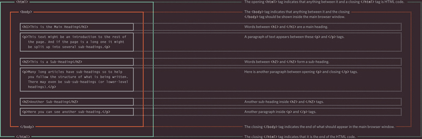

Tags act like containers. They tell you something about the information that lies between their opening and closing tags.

###SUMMARY STRUCTURE
* HTML pages are text documents
* HTML uses tags (characters that sit inside angled brackets) to give the information they surround special meaning.
* Tags are often referred to as elements.
* Tags usually come in pairs. The opening tag denotes the start of a piece of content; the closing tag denotes the end.
* Opening tags can carry attributes, which tell us more about the content of that element.
* Attributes require a name and a value.
* To learn HTML you need to know what tags are available for you to use, what they do, and where they can go.

##2. TEXT

* **Structural markup**: the elements that you can use to describe both headings and paragraphs
* **Semantic markup**: which provides extra information; such as where emphasis is placed in a sentence, that something you have written is a quotation (and who said it), the meaning of acronyms, and so on

###SEMANTIC MARKUP

There are some text elements that are not intended to affect the structure of your web pages, but they do add extra information to the pages — they are known as semantic markup.

For example, the ```<em>``` element allows you to indicate where emphasis should be placed on selected words and the ```<blockquote>``` element which indicates that a block of text is a quotation.
Browsers often display the contents of these elements in a different way. For example, the content of the ```<em>``` element is shown in italics, and a ```<blockquote>``` is usually indented. But **you should not use them to change the way that your text looks**; their purpose is to **describe the content** of your web pages more accurately.

The reason for using these elements is that other programs, such as screen readers or search engines, can use this extra information. For example, the voice of a screen reader may add emphasis to the words inside the ```<em>``` element, or a search engine might register that your page features a quote if you use the ```<blockquote>``` element.

###STRONG & EMPHASIS

####```<strong>```

The use of the ```<strong>``` element indicates that its content has strong importance. For example, the words contained in this element might be said with strong emphasis.

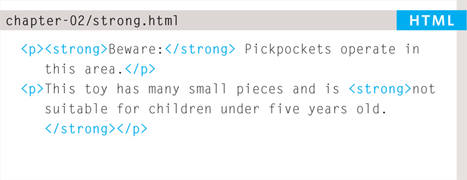
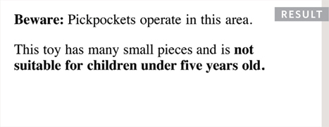

By default, browsers will show the contents of a ```<strong>``` element in bold.

####```<em>```

The ```<em>``` element indicates emphasis that subtly changes the meaning of a sentence.
By default browsers will show the contents of an ```<em>``` element in italic.

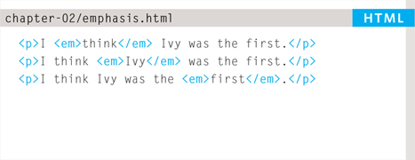
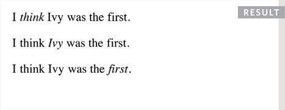

###QUOTATIONS

####```<blockquote>```

The ```<blockquote>``` element is used for longer quotes that take up an entire paragraph. Note how the ```<p>``` element is still used inside the ```<blockquote>``` element.
Browsers tend to indent the contents of the ```<blockquote>``` element, however you should not use this element just to indent a piece of text — rather you should achieve this effect using CSS.

####```<q>```

The ```<q>``` element is used for shorter quotes that sit within a paragraph. Browsers are supposed to put quotes around the ```<q>``` element, however Internet Explorer does not — therefore many people avoid using the ```<q>``` element.
Both elements may **use the ```cite``` attribute** to indicate where the quote is from. Its value should be a URL that will have more information about the source of the quotation.

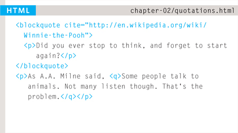
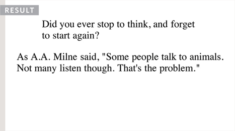

###ABBREVIATIONS & ACRONYMS

####```<abbr>```

If you use an abbreviation or an acronym, then the ```<abbr>``` element can be used. A ```title``` attribute on the opening tag is used to specify the full term.

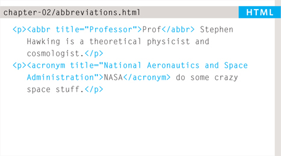
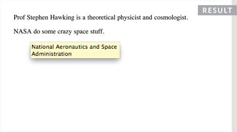

###CITATIONS & DEFINITIONS

####```<cite>```

When you are referencing a piece of work such as a book, film or research paper, the ```<cite>``` element can be used to indicate where the citation is from.

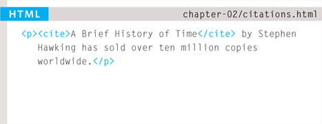
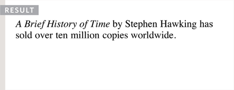

In HTML5, ```<cite>``` should not really be used for a person's name — but it was allowed in HTML 4, so most people are likely to continue to use it.
Browsers will render the content of a ```<cite>``` element in italics.

####```<dfn>```

The first time you explain some new terminology (perhaps an academic concept or some jargon) in a document, it is known as the defining instance of it.
The ```<dfn>``` element is used to indicate the defining instance of a new term.
Some browsers show the content of the ```<dfn>``` element in italics. Safari and Chrome do not change its appearance.

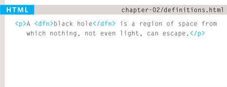
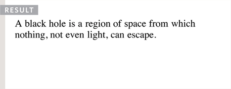

###AUTHOR DETAILS

####```<address>``` 

The ```<address>``` element has quite a specific use: to contain contact details for the author of the page.
It can contain a physical address, but it does not have to. For example, it may also contain a phone number or email address.

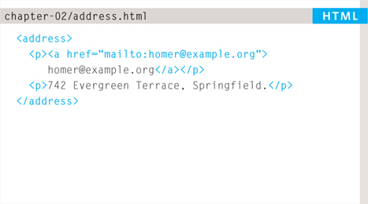
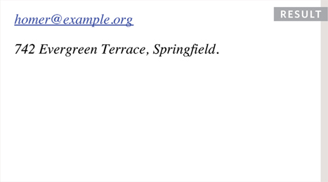

Browsers often display the content of the ```<address>``` element in italics.

You may also be interested in something called the *hCard* microformat for adding physical address information to your markup.

**ONLINE EXTRA**:
You can find out more about hCards on the website accompanying this book. http://www.htmlandcssbook.com/extras/

###CHANGES TO CONTENT

####```<ins>``` ```<del>```

The ```<ins>``` element can be used to show content that has been inserted into a document, while the ```<del>``` element can show text that has been deleted from it.

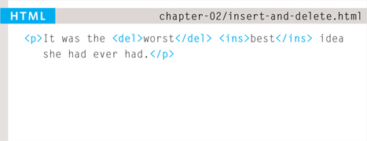
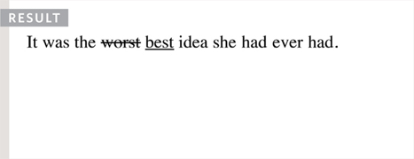

####```<s>```

The ```<s>``` element indicates something that is no longer accurate or relevant (but that should not be deleted).
Visually the content of an ```<s>``` element will usually be displayed with a line through the center.
Older versions of HTML had a ```<u>``` element for content that was underlined, but this is being phased out.

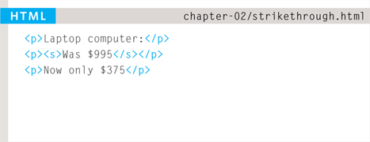


###SUMMARY TEXT
* HTML elements are used to describe the structure of the page (e.g. headings, subheadings, paragraphs).
* They also provide semantic information (e.g. where emphasis should be placed, the definition of any acronyms used, when given text is a quotation).

##3. LISTS

* **Ordered lists** (Numbered lists) are lists where each item in the list is numbered. For example, the list might be a set of steps for a recipe that must be performed in order, or a legal contract where each point needs to be identified by a section number.
* **Unordered lists** (Bullet lists) are lists that begin with a bullet point (rather than characters that indicate order).
* **Definition lists** are made up of a set of terms along with the definitions for each of those terms.

####ORDERED LISTS
#####```<ol>```
The ordered list is created with the ```<ol>``` element.
#####```<li>```
Each item in the list is placed between an opening ```<li>``` tag and a closing ```</li>``` tag. (The li stands for list item.)
Browsers indent lists by default.
Sometimes you may see a type attribute used with the ```<ol>``` element to specify the type of bullet point (circles, squares, diamonds and so on). It is better to use the CSS ```list-style-type``` property covered on pages 333-335.

####UNORDERED LISTS
#####```<ul>```
The ordered list is created with the ```<ul>``` element.
#####```<li>```
Each item in the list is placed between an opening ```<li>``` tag and a closing ```</li>``` tag. (The li stands for list item.)
Browsers indent lists by default.
Sometimes you may see a type attribute used with the ```<ul>``` element to specify the type of bullet point (circles, squares, diamonds and so on). It is better to use the CSS ```list-style-type``` property covered on pages 333-335.

####DEFINITION LISTS

#####```<dl>```
The definition list is created with the ```<d1>``` element and usually consists of a series of terms and their definitions.
Inside the ```<d1>``` element you will usually see pairs of ```<dt>``` and ```<dd>``` elements.
#####```<dt>```
This is used to contain the term being defined (the definition term).
#####```<dd>```
This is used to contain the definition.
Sometimes you might see a list where there are two terms used for the same definition or two different definitions for the same term.

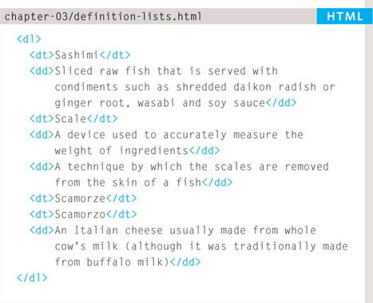
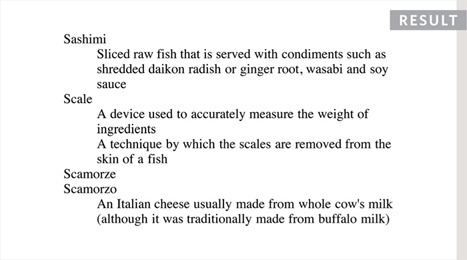

####NESTED LISTS

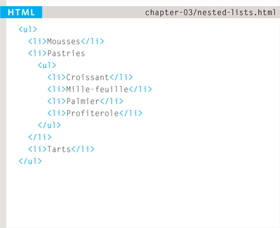
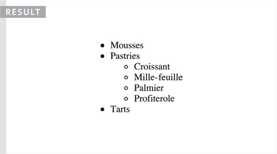

You can put a second list inside an ```<li>``` element to create a sub-list or nested list.
Browsers display nested lists indented further than the parent list. In nested unordered lists, the browser will usually change the style of the bullet point too.

####SUMMARY LISTS
There are three types of HTML lists: **ordered**, **unordered**, and **definition**.
* Ordered lists use numbers.
* Unordered lists use bullets.
* Definition lists are used to define terminology.
* Lists can be nested inside one another.

##4. LINKS

###OPENING LINKS IN A NEW WINDOW
####```target```

If you want a link to open in a new window, you can use the target attribute on the opening ```<a>``` tag. The value of this attribute should be ```_blank```.

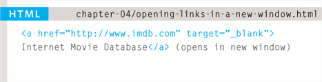
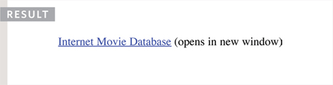

One of the most common reasons a web page author might want a link to be opened in a new window is if it points to another website. In such cases, they hope the user will return to the window containing their site after finishing looking at the other one.

Generally you should avoid opening links in a new window, but if you do, it is considered good practice to inform users that the link will open a new window before they click on it.

##5. IMAGES

###CHOOSING IMAGES FOR YOUR SITE

Images can be used to set the tone for a site in less time than it takes to read a description. If you do not have photographs to use on your website, there are companies who sell stock images; these are images you pay to use (there is a list of stock photography websites below). Remember that all images are subject to copyright, and you can get in trouble for simply taking photographs from another website.

####IMAGES SHOULD…
* Be relevant
* Convey information
* Convey the right mood
* Be instantly recognisable
* Fit the color palette

####STOCK PHOTOS
* http://www.istockphoto.com
* http://www.gettyimages.com
* http://www.veer.com
* http://www.sxc.hu
* http://www.fotolia.com

####ONLINE EXTRA

We have provided an online gallery that helps you choose the right image for your website. You can find it in the tools section of the site accompanying this book. http://www.htmlandcssbook.com/extras/

###HEIGHT & WIDTH OF IMAGES

You will also often see an `````` element use two other attributes that specify its size:

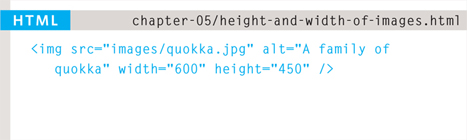


####height
This specifies the height of the image in pixels.

####width
This specifies the width of the image in pixels.

Images often take longer to load than the HTML code that makes up the rest of the page. It is, therefore, a good idea to specify the size of the image so that the browser can render the rest of the text on the page while leaving the right amount of space for the image that is still loading.

The size of images is increasingly being specified using CSS rather than HTML — see pages 409-410 for more information about this.

###WHERE TO PLACE IMAGES IN YOUR CODE

Where an image is placed in the code will affect how it is displayed. Here are three examples of image placement that produce different results:

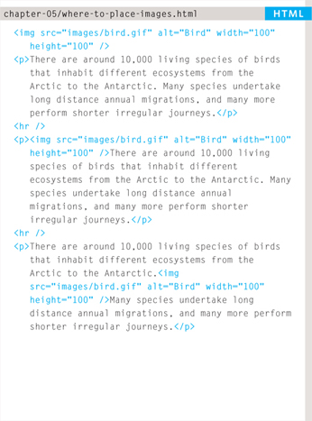

1. **BEFORE A PARAGRAPH**: The paragraph starts on a new line after the image.
2. **INSIDE THE START OF A PARAGRAPH**: The first row of text aligns with the bottom of the image.
3. **IN THE MIDDLE OF A PARAGRAPH**: The image is placed between the words of the paragraph that it appears in.

Where you place the image in the code is important because browsers show HTML elements in one of two ways:

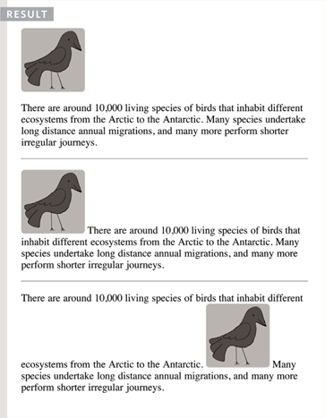

**Block elements always appear on a new line**. Examples of block elements include the ```<h1>``` and ```<p>``` elements.
If the `````` is followed by a block level element (such as a paragraph) then the block level element will sit on a new line after the imageas shown in the first example on this page.

**Inline elements sit within a block level element and do not start on a new line**. Examples of inline elements include the ```<b>```, ```<em>```, and `````` elements.
If the `````` element is inside a block level element, any text or other inline elements will flow around the image as shown in the second and third examples on this page.
Block and inline elements are discussed in greater depth on pages 185-186.

###OLD CODE: ALIGNING IMAGES HORIZONTALLY AND VERTICALLY

####align
The align attribute was commonly used to indicate how the other parts of a page should flow around an image. It has been removed from HTML5 and new websites should use CSS to control the alignment of images (as you will see on pages 411-412).

###THREE RULES FOR CREATING IMAGES

There are three rules to remember when you are creating images for your website which are summarized below. We go into greater detail on each topic over the next nine pages.

1. **SAVE IMAGES IN THE RIGHT FORMAT**: Websites mainly use images in jpeg, gif, or png format. If you choose the wrong image format then your image might not look as sharp as it should and can make the web page slower to load.

2. **SAVE IMAGES AT THE RIGHT SIZE**: You should save the image at the same width and height it will appear on the website. If the image is smaller than the width or height that you have specified, the image can be distorted and stretched. If the image is larger than the width and height if you have specified, the image will take longer to display on the page.

3. **USE THE CORRECT RESOLUTION**: Computer screens are made up of dots known as pixels. Images used on the web are also made up of tiny dots. Resolution refers to the number of dots per inch, and most computer screens only show web pages at 72 pixels per inch. So saving images at a higher resolution results in images that are larger than necessary and take longer to download.

####TOOLS TO EDIT & SAVE IMAGES

#####SOFTWARES
* Adobe Photoshop
* Adobe Fireworks
* Pixelmator
* PaintShop Pro
* Paint.net

#####ONLINE EDITORS
* http://www.photoshop.com
* http://www.pixlr.com
* http://www.splashup.com
* http://www.ipiccy.com

#####ONLINE EXTRA
Watch videos that demonstrate how to resize images and save them in the correct format using both of these applications.  http://www.htmlandcssbook.com/extras/

#####JPEG Images
Whenever you have many different colors in a picture you should use a JPEG. A photograph that features snow or an overcast sky might look like it has large areas that are just white or gray, but the picture is usually made up of many different colors that are subtly different.

#####PNG or GIF images
Use GIF or PNG when saving images with few colors or large areas of the same color.

When a picture has an area that is filled with exactly the same color, it is known as flat color. Logos, illustrations, and diagrams often use flat colors. (Note that photographs of snow, sky, or grass are not flat colors, they are made up of many subtly different shades of the same color and are not as suited to GIF or PNG format.)

####IMAGE DIMENSIONS

The images you use on your website should be saved at the same width and height that you want them to appear on the page.
For example, if you have designed a page to include an image that is 300 pixels wide by 150 pixels tall, the image you use should be 300 × 150 pixels. You may need to use image editing tools to resize and crop the image. When sourcing images, it is important to understand how you can alter the dimensions of an image; imagine that you had designed a web page to include an image that is 300 pixels wide by 150 pixels tall:

#####ONLINE EXTRA
Visit the tools section of the website accompanying this book to watch a video guide to resizing images in Photoshop and GIMP.  http://www.htmlandcssbook.com/extras/

#####REDUCING IMAGE SIZE
You can reduce the size of images to create a smaller version of the image.
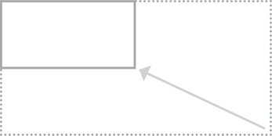

**Example**: If your image is 600 pixels wide and 300 pixels tall, you can reduce the size of the image by 50%. 

**Result**: This will create an image that is quicker to download.

#####INCREASING IMAGE SIZE
You can't increase the size of photos significantly without affecting the image quality.


**Example**: If your image is only 100 pixels wide by 50 pixels tall, increasing the size by 300% would result in poor quality.

**Result**: The image will look blurry or blocky.

#####CHANGING SHAPE
Only some images can be cropped without losing valuable information (see next page).

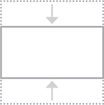

**Example**: If your image is 300 pixels square, you can remove parts of it, but in doing so you might lose valuable information.

**Result**: Only some images can be cropped and still make sense.

####IMAGE RESOLUTION
Images created for the web should be saved at a resolution of 72 ppi. The higher the resolution of the image, the larger the size of the file.

JPGs, GIFs, and PNGs belong to a type of image format known as bitmap. They are made up of lots of miniature squares. The resolution of an image is the number of squares that fit within a 1 inch × 1 inch square area.

Images appearing on computer screens are made of tiny squares called pixels. A small segment of this photograph has been magnified to show how it is made up of pixels. The web browsers on most desktop computers display images at a resolution of 72 pixels per inch (ppi). Images in print materials (such as books and magazines) are made up of tiny circles called dots. These images are usually printed at a resolution of 300 dots per inch (dpi).

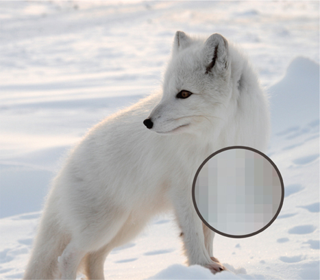

For this image:
* JPEG at 300 dpi = 1,526kb
* JPEG at 72 ppi = 368kb

Due to the fact that computer displays are capped at a resolution of 72 ppi, using images on the web with a higher resolution will not result in better image quality — only in larger file sizes, which will increase the time needed to load them and therefore slow down viewing of your web pages.

####VECTOR IMAGES
Vector images differ from bitmap images and are resolution-independent. Vector images are commonly created in programs such as Adobe Illustrator.


When an image is a line drawing (such as a logo, illustration, or diagram), designers will often create it in vector format. Vector formatted images are very different to bitmap images.

Vector images are created by placing points on a grid, and drawing lines between those points. A color can then be added to “fill in” the lines that have been created.

The advantage of creating line drawings in vector format is that you can increase the dimensions of the image without affecting the quality of it.

The current method of using vector images for display on websites involves saving a bitmap version of the original vector image and using that.


Scalable Vector Graphics (SVG) are a relatively new format used to display vector images directly on the web (eliminating the need to create bitmap versions of them), however its use is not yet widespread.

####TRANSPARENCY

Creating an image that is partially transparent (or “see-through”) for the web involves selecting one of two formats:

#####TRANSPARENT GIF
If the transparent part of the image has straight edges and it is 100% transparent (that is, not semi-opaque), you can save the image as a GIF (with the transparency option selected).

#####PNG
If the transparent part of the image has diagonal or rounded edges or if you want a semi-opaque transparency or a drop-shadow, then you will need to save it as a PNG.
Transparent PNGs are not fully supported in older browsers, most notably Internet Explorer 6 (IE6). There is some JavaScript you can use to get around this issue. The details of this script can be found in the tools section of the website accompanying this book.


####HTML5: FIGURE AND FIGURE CAPTION
#####```<figure>```
Images often come with captions. HTML5 has introduced a new ```<figure>``` element to contain images and their caption so that the two are associated.

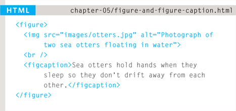
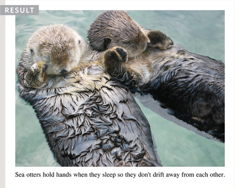

You can have more than one image inside the ```<figure>``` element as long as they all share the same caption.

**```<figcaption>```**

The ```<figcaption>``` element has been added to HTML5 in order to allow web page authors to add a caption to an image.

Before these elements were created there was no way to associate an `````` element with its caption.

Older browsers that do not understand HTML5 elements simply ignore the new elements and display the content of them.

In this example, the logo is a GIF because it uses flat colors, while the photographs are JPEGs. The main photo is placed inside the HTML5 ```<figure>``` element and has its own caption.

The alt attribute on each image provides a description for those using screen readers and the title attribute provides additional information. (This is shown in the tooltip.)

This example does not use the ```height```, ```width```, or ```align``` attributes as these are being phased out and you are encouraged to use CSS properties instead.

###SUMMARY IMAGES
The `````` element is used to add images to a web page.
You must always specify a src attribute to indicate the source of an image and an alt attribute to describe the content of an image.
You should save images at the size you will be using them on the web page and in the appropriate format.
Photographs are best saved as JPEGs; illustrations or logos that use flat colors are better saved as GIFs.

##6. TABLES

###SPANNING COLUMNS

Sometimes you may need the entries in a table to stretch across more than one column.

The colspan attribute can be used on a ```<th>``` or ```<td>``` element and indicates how many columns that cell should run across.
In the example on the right you can see a timetable with five columns; the first column contains the heading for that row (the day), the remaining four represent one hour time slots.

If you look at the table cell that contains the words ‘Geography’ you will see that the value of the colspan attribute is 2, which indicates that the cell should run across two columns. In the third row, ‘Gym’ runs across three columns.

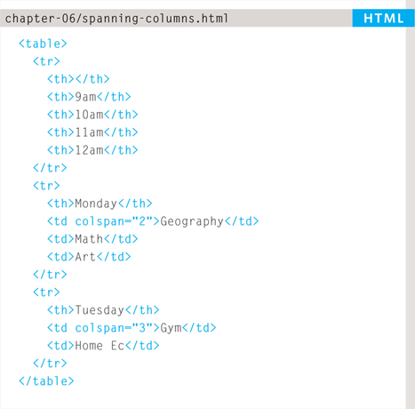
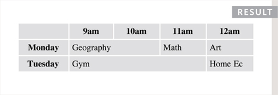

You can see that the second and third rows have fewer ```<td>``` elements than there are columns. This is because, when a cell extends across more than one column, the ```<td>``` or ```<th>``` cells that would have been in the place of the wider cells are not included in the code.

###SPANNING ROWS

You may also need entries in a table to stretch down across more than one row.

The rowspan attribute can be used on a ```<th>``` or ```<td>``` element to indicate how many rows a cell should span down the table.

In the example on the left you can see that ABC is showing a movie from 6pm - 8pm, whereas the BBC and CNN channels are both showing two programs during this time period (each of which lasts one hour).

If you look at the last ```<tr>``` element, it only contains three elements even though there are four columns in the result below. This is because the movie in the ```<tr>``` element above it uses the rowspan attribute to stretch down and take over the cell below.

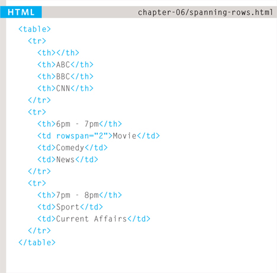
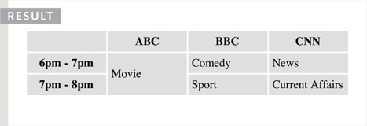

###LONG TABLES

There are three elements that help distinguish between the main content of the table and the first and last rows (which can contain different content).

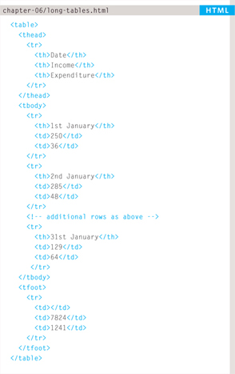

These elements help people who use screen readers and also allow you to style these sections in a different manner than the rest of the table (as you will see when you learn about CSS).

####**```<thead>```**
The headings of the table should sit inside the ```<thead>``` element.

####**```<tbody>```**
The body should sit inside the ```<tbody>``` element.

####**```<tfoot>```**
The footer belongs inside the ```<tfoot>``` element.

By default, browsers rarely treat the content of these elements any differently than other elements however designers often use CSS styles to change their appearance.
Some of the HTML editors that come in content management systems offer tools to help draw tables. If the first row of your table only contains ```<th>``` elements then you may find that the editor inserts a ```<thead>``` element automatically.

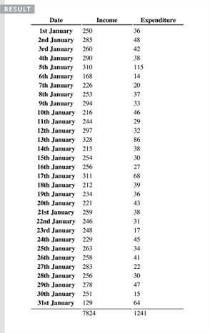

Part of the reason for having separate ```<thead>``` and ```<tfoot>``` elements is so that, if you have a table that is taller than the screen (or, if printed, longer than one page) then the browser can keep the header and footer visible whilst the contents of the table scroll. This is intended to make it easier for users to see which column the data is in (however this functionality is not implemented by default in any current browser).

###OLD CODE: WIDTH & SPACING
There are some outdated attributes which you should not use on new websites.  
All of these attributes have been replaced by the use of CSS.

###OLD CODE: BORDER & BACKGROUND
When building a new website you should use CSS to control the appearance of the table rather than these attributes.

###SUMMARY TABLES
* The ```<table>``` element is used to add tables to a web page.
* A table is drawn out row by row. Each row is created with the ```<tr>``` element.
* Inside each row there are a number of cells represented by the ```<td>``` element (or ```<th>``` if it is a header).
* You can make cells of a table span more than one row or column using the rowspan and colspan attributes.
* For long tables you can split the table into a ```<thead>```, ```<tbody>```, and ```<tfoot>```.

##7. FORMS

###LABELLING FORM CONTROLS

####**```<label>```**

When introducing form controls, the code was kept simple by indicating the purpose of each one in text next to it. However, each form control should have its own ```<label>``` element as this makes the form accessible to vision-impaired users.

The ```<label>``` element can be used in two ways. It can:
* Wrap around both the text description and the form input (as shown on the first line of the example to your right).
* Be kept separate from the form control and use the for attribute to indicate which form control it is a label for (as shown with the radio buttons).

####**```for```**

The for attribute states which form control the label belongs to. Note how the radio buttons use the id attribute. The value of the id attribute uniquely identifies an element from all other elements on a page. (The id attribute is covered on page 183.)

The value of the for attribute matches that of the id attribute on the form control it is labelling. This technique using the for and id attributes can be used on any form control. When a ```<label>``` element is used with a checkbox or radio button, users can click on either the form control or the label to select. The expanded clickable area makes the form easier to use. The position of the label is very important. If users do not know where to enter information or what information to enter, they are less likely to use the form correctly.

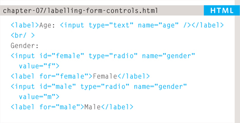
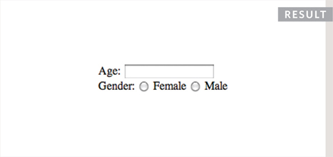

As a rule of thumb, here are the best places to place labels on form controls.

**ABOVE OR TO THE LEFT**:
* Text inputs
* Text areas
* Select boxes
* File uploads

**TO THE RIGHT**:
* Individual checkboxes
* Individual radio buttons

###GROUPING FORM ELEMENTS
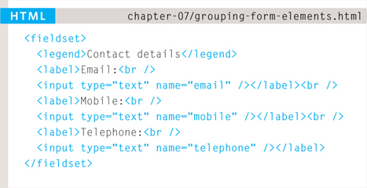
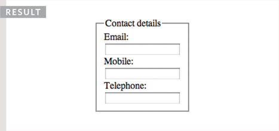

####**```<fieldset>```**
You can group related form controls together inside the ```<fieldset>``` element. This is particularly helpful for longer forms.

Most browsers will show the fieldset with a line around the edge to show how they are related. The appearance of these lines can be adjusted using CSS.
####**```<legend>```**

The ```<legend>``` element can come directly after the opening ```<fieldset>``` tag and contains a caption which helps identify the purpose of that group of form controls.

###HTML5: FORM VALIDATION

Traditionally, form validation has been performed using JavaScript (which is beyond the scope of this book). But HTML5 is introducing validation and leaving the work to the browser.

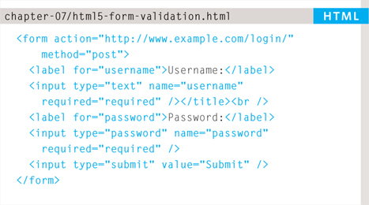
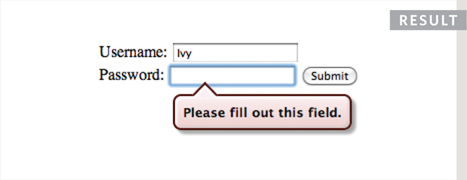

An example of HTML5 form validation is the required attribute, which can be used on any form element that the user is expected to fill in. This HTML5 attribute does not need a value, but in HTML 4 all attributes must have a value. So, some people give this attribute a value of required.

###HTML5: DATE INPUT

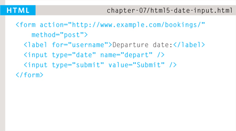
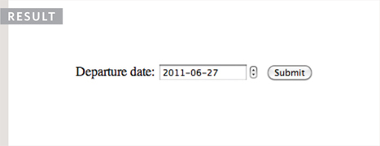

####**```type=“date”```**
If you are asking the user for a date, you can use an ```<input>``` element and give the type attribute a value of date. This will create a date input in browsers that support the new HMTL5 input types.
This example shows what the date input looks like in the Opera browser. The appearance of the date input changes across different browsers.

###HTML5: EMAIL & URL INPUT

####**```type=“email”```**
If you ask a user for an email address, you can use the email input. Browsers that support HTML5 validation will check that the user has provided information in the correct format of an email address. Some smart phones also optimize their keyboard to display the keys you are most likely to need when entering an email address (such as the @ symbol).

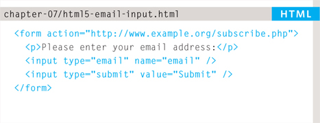
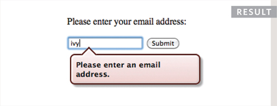

####**```type=“url”```**
A URL input can be used when you are asking a user for a web page address. Browsers that support HTML5 validation will check that the user has provided information in the format of a URL. Some smart phones also optimize their keyboard to display the keys you are most likely to need when entering a URL.

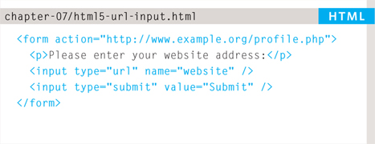


###HTML5: SEARCH INPUT

####**```type=“search”```**

If you want to create a single line text box for search queries, HTML5 provides a special search input.

To create the HTML5 search box the ```<input>``` element should have a ```type``` attribute whose ```value``` is search. Older browsers will simply treat it like a single line text box.

Recent browsers add some features that improve usability. For example, Safari on a Mac adds a cross to clear the search box when you have started to enter information. Safari also automatically rounds the corners on the search input field.


####**```placeholder```**

On any text input, you can also use an attribute called ```placeholder``` whose value is text that will be shown in the text box until the user clicks in that area. Older browsers simply ignore this attribute.


###SUMMARY FORMS
* Whenever you want to collect information from visitors you will need a form, which lives inside a ```<form>``` element.
* Information from a form is sent in name/value pairs.
* Each form control is given a name, and the text the user types in or the values of the options they select are sent to the server.
* HTML5 introduces new form elements which make it easier for visitors to fill in forms.

##8. EXTRA MARKUP

###DOCTYPES
Because there have been several versions of HTML, each web page should begin with a DOCTYPE declaration to tell a browser which version of HTML the page is using (although browsers usually display the page even if it is not included). 

As you will see when we come to look at CSS and its box model on page 316, the use of a DOCTYPE can also help the browser to render a page correctly.

Because XHTML was written in XML, you will sometimes see pages that use the XHTML strict DOCTYPE start with the optional XML declaration. Where this is used, it should be the first thing in a document. There must be nothing before it, not even a space.


###ID ATTRIBUTE

Every HTML element can carry the id attribute. It is used to uniquely identify that element from other elements on the page. Its value should start with a letter or an underscore (not a number or any other character). **It is important that no two elements on the same page have the same value for their id attributes** (otherwise the value is no longer unique).

As you will see when you come to look at CSS in the next section, giving an element a unique identity allows you to style it differently than any other instance of the same element on the page. For example, you might want to assign one paragraph within the page (perhaps a paragraph containing a pull quote) a different style than all of the other paragraphs. In the example on the right, the paragraph with the id attribute whose value is pullquote is made uppercase using CSS.

If you go on to learn about JavaScript (a language that allows you to add interactivity to your pages), id attributes can be used to allow the script to work with that particular element.

The id attribute is known as a **global attribute** because it can be used on any element.


###CLASS ATTRIBUTE


Every HTML element can also carry a class attribute. Sometimes, rather than uniquely identifying one element within a document, you will want a way to identify several elements as being different from the other elements on the page. For example, you might have some paragraphs of text that contain information that is more important than others and want to distinguish these elements, or you might want to differentiate between links that point to other pages on your own site and links that point to external sites.

To do this you can use the ```class``` attribute. Its ```value``` should describe the ```class``` it belongs to. In the example on the left, key paragraphs have a ```class``` attribute whose ```value``` is ```important```.

The ```class``` attribute on any element can share the same value. So, in this example, the value of ```important``` could be used on headings and links, too.

By default, using these attributes does not affect the presentation of an element. It will only change their appearance if there is a CSS rule that indicates it should be displayed differently.

In this example, CSS has been applied to make elements with a ```class``` attribute whose value is ```important``` uppercase, and elements with a ```class``` attribute whose value is ```admittance``` red.

If you would like to indicate that an element belongs to several classes, you can separate ```class``` names with a space, as you can see in the third paragraph in the example above.

###BLOCK ELEMENTS
Some elements will always appear to start on a new line in the browser window. These are known as **block level** elements.


Examples of block elements are ```<h1>```, ```<p>```, ```<ul>```, and ```<li>```.


###INLINE ELEMENTS


Some elements will always appear to continue on the same line as their neighbouring elements. These are known as **inline** elements.


Examples of inline elements are ```<a>```, ```<b>```, ```<em>```, and ``````.

###GROUPING TEXT & ELEMENTS IN A BLOCK

####**```<div>```**

The ```<div>``` element allows you to group a set of elements together in one block-level box.

For example, you might create a ```<div>``` element to contain all of the elements for the header of your site (the logo and the navigation), or you might create a ```<div>``` element to contain comments from visitors.

In a browser, the contents of the ```<div>``` element will start on a new line, but other than this it will make no difference to the presentation of the page.

Using an id or class attribute on the ```<div>``` element, however, means that you can create CSS style rules to indicate how much space the ```<div>``` element should occupy on the screen and change the appearance of all the elements contained within it.

It can also make it easier to follow your code if you have used ```<div>``` elements to hold each section of the page.


###GROUPING TEXT & ELEMENTS INLINE


####**```<span>```**

The ```<span>``` element acts like an inline equivalent of the ```<div>``` element. It is used to either:

* Contain a section of text where there is no other suitable element to differentiate it from its surrounding text
* Contain a number of inline elements

The most common reason why people use ```<span>``` elements is so that they can control the appearance of the content of these elements using CSS.

You will usually see that a class or id attribute is used with ```<span>``` elements:
* To explain the purpose of this ```<span>``` element
* So that CSS styles can be applied to elements that have specific values for these attributes

###IFRAMES

####**```<iframe>```**
An iframe is like a little window that has been cut into your page — and in that window you can see another page. The term iframe is an abbreviation of inline frame.
One common use of iframes (that you may have seen on various websites) is to embed a Google Map into a page. The content of the iframe can be any html page (either located on the same server or anywhere else on the web).
An iframe is created using the ```<iframe>``` element. There are a few attributes that you will need to know to use it:

**```src```**

The src attribute specifies the URL of the page to show in the frame.

**```height```**

The height attribute specifies the height of the iframe in pixels.

**```width```**

The width attribute specifies the width of the iframe in pixels.


**```scrolling```** (NOT SUPPORTED IN HTML5)

The scrolling attribute will not be supported in HTML5. In HTML 4 and XHTML, it indicates whether the iframe should have scrollbars or not. This is important if the page inside the iframe is larger than the space you have allowed for it (using the height and width attributes). Scrollbars allow the user to move around the frame to see more content. It can take one of three values: yes (to show scrollbars), no (to hide scrollbars) and auto (to show them only if needed).

**```frameborder```** (NOT SUPPORTED IN HTML5)

The frameborder attribute will not be supported in HTML5. In HTML 4 and XHTML, it indicates whether the frame should have a border or not. A value of 0 indicates that no border should be shown. A value of 1 indicates that a border should be shown.

**```seamless```**

In HTML5, a new attribute called seamless can be applied to an iframe where scrollbars are not desired. The seamless attribute (like some other new HTML5 attributes) does not need a value, but you will often see authors give it a value of seamless. Older browsers do not support the seamless attribute.

###INFORMATION ABOUT YOUR PAGES

####**```<meta>```**
The ```<meta>``` element lives inside the ```<head>``` element and contains information about that web page.

It is not visible to users but fulfills a number of purposes such as telling search engines about your page, who created it, and whether or not it is time sensitive. (If the page is time sensitive, it can be set to expire.)

The ```<meta>``` element is an empty element so it does not have a closing tag. It uses attributes to carry the information.

The most common attributes are the ```name``` and ```content``` attributes, which tend to be used together. These attributes specify properties of the entire page. The value of the ```name``` attribute is the property you are setting, and the value of the ```content``` attribute is the value that you want to give to this property.

In the first line of the example on the opposite page, you can see a ```<meta>``` element where the ```name``` attribute indicates an intention to specify a description for the page. The ```content``` attribute is where this description is actually specified.

The value of the ```name``` attribute can be anything you want it to be. Some defined values for this attribute that are commonly used are:

**```description```**

This contains a description of the page. This description is commonly used by search engines to understand what the page is about and should be a maximum of 155 characters. Sometimes it is also displayed in search engine results.

**```keywords```**

This contains a list of commaseparated words that a user might search on to find the page. In practice, this no longer has any noticeable effect on how search engines index your site.

**```robots```**

This indicates whether search engines should add this page to their search results or not. A value of **```noindex```** can be used if this page should not be added. A value of **```nofollow```** can be used if search engines should add this page in their results but not any pages that it links to.


The ```<meta>``` element also uses the http-equiv and content attributes in pairs. In our example, you can see three instances of the http-equiv attribute. Each one has a different purpose:

**```author```**

This defines the author of the web page.

**```pragma```**

This prevents the browser from caching the page. (That is, storing it locally to save time downloading it on subsequent visits.)

**```expires```**

Because browsers often cache the content of a page, the expires option can be used to indicate when the page should expire (and no longer be cached). Note that the date must be specified in the format shown.


###ESCAPE CHARACTERS

There are some characters that are used in and reserved by HTML code. (For example, the left and right angled brackets.)

Therefore, if you want these characters to appear on your page you need to use what are termed “escape” characters (also known as escape codes or entity references). For example, to write a left angled bracket, you can use either ```&lt;``` or ```&#60;```. For an ampersand, you can use either ```&amp;``` or ```&#38;```.

There are also special codes that can be used to show symbols such as copyright and trademark, currency symbols, mathematical characters, and some punctuation marks. For example, if you want to include a copyright symbol on a web page you can use either ```&copy;``` or ```&#169;```.

When using escape characters, it is important to check the page in your browser to ensure that the correct symbol shows up. This is because some fonts do not support all of these characters and you might therefore need to specify a different font for these characters in your CSS code.

####ONLINE EXTRA
You can find a more complete list of escape codes in the tools section of the website accompanying this book. http://www.htmlandcssbook.com/extras/html-escape-codes/


###SUMMARY EXTRA MARKUP

* DOCTYPES tell browsers which version of HTML you are using.
* You can add comments to your code between the <!- - and --> markers.
* The id and class attributes allow you to identify particular elements.
* The ```<div>``` and ```<span>``` elements allow you to group block-level and inline elements together.
* ```<iframes>``` cut windows into your web pages through which other pages can be * displayed.
* The ```<meta>``` tag allows you to supply all kinds of information about your web page.
* Escape characters are used to include special characters in your pages such as <, >, and ©.

##10. INTRODUCING CSS

###UNDERSTANDING CSS: THINKING INSIDE THE BOX

The key to understanding how CSS works is to imagine that there is an invisible box around every HTML element.

On this page, you can see a basic HTML page.

On the right hand page, you can see the same HTML page, but I have added outlines to each of the elements so that you can see how CSS will treat each element as if it lives inside its own box.


###BLOCK & INLINE ELEMENTS

Block level elements look like they start on a new line. Examples include the ```<h1>-<h6>```, ```<p>``` and ```<div>``` elements.
Inline elements flow within the text and do not start on a new line. Examples include ```<b>```, ```<i>```, ``````, ```<em>``` and ```<span>```.

CSS allows you to create rules that control the way that each individual box (and the contents of that box) is presented.

In this example, block level elements are shown with red borders, and inline elements have green borders.


The ```<body>``` element creates the first box, then the ```<h1>```, ```<h2>```, ```<p>```, ```<i>```, and ```<a>``` elements each create their own boxes within it.

Using CSS, you could add a border around any of the boxes, specify its width and height, or add a background color. You could also control text inside a box — for example, its color, size, and the typeface used.

###EXAMPLE STYLES

####BOXES
* Width and height
* Borders (color, width, and style)
* Background color and images
* Position in the browser window.

####TEXT
* Typeface
* Size
* Color
* Italics, bold, uppercase, lowercase, small-caps

####SPECIFIC
* There are also specific ways in which you can style certain elements such as lists, tables, and forms.

###CSS SELECTORS

The table on the opposite page introduces the most commonly used CSS selectors.

There are some more advanced selectors which allow you to select elements based on attributes and their values, which you will see on page 292.


###HOW CSS RULES CASCADE

If there are two or more rules that apply to the same element, it is important to understand which will take precedence.

####LAST RULE
If the two selectors are identical, the latter of the two will take precedence. Here you can see the second i selector takes precedence over the first.

####SPECIFICITY
If one selector is more specific than the others, the more specific rule will take precedence over more general ones. In this example:

```h1``` is more specific than ```*```

```p b``` is more specific than ```p```

```p#intro``` is more specific than ```p```


####IMPORTANT
You can add ```!important``` after any property value to indicate that it should be considered more important than other rules that apply to the same element.

Understanding how CSS rules cascade means you can write simpler style sheets because you can create generic rules that apply to most elements and then override the properties on individual elements that need to appear differently.

###INHERITANCE

If you specify the ```font-family``` or ```color``` properties on the ```<body>``` element, they will apply to most child elements. This is because the value of the ```font-family``` property is **inherited** by child elements. It saves you from having to apply these properties to as many elements (and results in simpler style sheets).


You can compare this with the background-color or border properties; they are **not inherited** by child elements. If these were inherited by all child elements then the page could look quite messy.

You can force a lot of properties to inherit values from their parent elements by using inherit for the value of the properties. In this example, the ```<div>``` element with a class called page inherits the padding size from the CSS rule that applies to the ```<body>``` element.

###DIFFERENT VERSIONS OF CSS & BROWSER QUIRKS

You do not need lots of computers to test your site, as there are online tools to show you what a page looks like in multiple browsers:

http://browsercam.com

http://BrowserLab.Adobe.com

http://BrowserShots.org

http://CrossBrowserTesting.com

Using these tools, it is a good idea to check the site on different operating systems (PC, Mac, and Linux) and in older versions of the major browsers, as well as recent versions.

When you look at your site in more than one browser, you might find that some elements on your page do not look as you expect them to.

When a CSS property does not display as expected, it is generally referred to as a **browser quirk** or **CSS bug**.

If you come across a CSS bug, you can use your favorite search engine to try and find a solution. Or you can check these sites:
* http://PositionIsEverything.net
* http://QuirksMode.org

###SUMMARY
####INTRODUCING CSS
* CSS treats each HTML element as if it appears inside its own box and uses rules to indicate how that element should look.

* Rules are made up of selectors (that specify the elements the rule applies to) and declarations (that indicate what these elements should look like).

* Different types of selectors allow you to target your rules at different elements.

* Declarations are made up of two parts: the properties of the element that you want to change, and the value of those properties. For example, the font-family property sets the choice of font, and the value arial specifies Arial as the preferred typeface.

* CSS rules usually appear in a separate document, although they may appear within an HTML page.

##11. COLOR

###FOREGROUND COLOR

####color

The color property allows you to specify the color of text inside an element. You can specify any color in CSS in one of three ways:

####RGB VALUES

These express colors in terms of how much red, green and blue are used to make it up. For example: ```rgb(100,100,90)```

####HEX CODES

These are six-digit codes that represent the amount of red, green and blue in a color, preceded by a pound or hash ```#``` sign. For example: ```#ee3e80```

####COLOR NAMES

There are 147 predefined color names that are recognized by browsers. For example: ```DarkCyan```

###BACKGROUND COLOR

####background-color

CSS treats each HTML element as if it appears in a box, and the background-color property sets the color of the background for that box.

If you do not specify a background color, then the background is transparent.

###UNDERSTANDING COLOR

Every color on a computer screen is created by mixing amounts of red, green, and blue. To find the color you want, you can use a color picker.

The color of every pixel on the screen is expressed in terms of a mix of red, green, and blue – just like on a television screen.

The hex value is provided next to the pound or hash # symbol. There is also a good color picking tool at: http://colorschemedesigner.com


####RGB VALUES

Values for red, green, and blue are expressed as numbers between 0 and 255.

**```rgb(102,205,170)```**

This color is made up of the following values:
* 102 red
* 205 green
* 170 blue

####HEX CODES
Hex values represent values for red, green, and blue in hexadecimal code.

**```#66cdaa```**

The value of the ```red```, ```102```, is expressed as ```66``` in hexadecimal code. The ```205``` of the ```green``` is expressed as ```cd``` and the ```170``` of the ```blue``` equates to ```aa```.

####COLOR NAMES
Colors are represented by predefined names. However, they are very limited in number.

**```MediumAquaMarine```**

There are 147 color names supported by browsers (this color is MediumAquaMarine). Most consider this to be a limited color palette, and it is hard to remember the name for each of the colors so (apart from white and black) they are not commonly used.

####HUE
Hue is near to the colloquial idea of color. Technically speaking however, a color can also have saturation and brightness as well as hue.


####SATURATION

Saturation refers to the **amount of gray** in a color. At maximum saturation, there would be no gray in the color. At minimum saturation, the color would be mostly gray.


####BRIGHTNESS
Brightness (or “value”) refers to **how much black** is in a color. At maximum brightness, there would be no black in the color. At minimum brightness, the color would be very dark.


###CONTRAST
When picking foreground and background colors, it is important to ensure that there is enough contrast for the text to be legible.


**Low Contrast** - Text is harder to read when there is low contrast between background and foreground colors.


**High Contrast** - Text is easier to read when there is higher contrast between background and foreground colors.

If you want people to read a lot of text on your page, however, then too much contrast can make it harder to read, too.


**Medium Contrast** - For long spans of text, reducing the contrast a little bit improves readability.
You can reduce contrast by using dark gray text on a white background or an off-white text on a dark background.

**If text is reversed out (a light color on a dark background), you can increase the height between lines and the weight of the font to make it easier to read.**

To check contrast there is a handy online tool at: http://www.snook.ca/technical/colour_contrast/colour.html

###CSS3: OPACITY

**```opacity```, ```rgba```**


CSS3 introduces the opacity property which allows you to specify the opacity of an element and any of its child elements. The value is a number between 0.0 and 1.0 (so a value of 0.5 is 50% opacity and 0.15 is 15% opacity).

The CSS3 rgba property allows you to specify a color, just like you would with an RGB value, but adds a fourth value to indicate opacity. This value is known as an **```alpha```** value and is a number between 0.0 and 1.0 (so a value of 0.5 is 50% opacity and 0.15 is 15% opacity). **The rgba value will only affect the element on which it is applied (not child elements)**.

Because some browsers will not recognize RGBA colors, you can offer a fallback so that they display a solid color. If there are two rules that apply to the same element, the latter of the two will take priority. To create the fallback, you can specify a color as a hex code, color name or RGB value, followed by the rule that specifies an RGBA value. If the browser understands RGBA colors it will use that rule. If it doesn't, it will use the RGB value.

At the time of writing, the opacity and rgba properties are only supported by the most recent browsers.

###CSS3: HSL COLORS

CSS3 introduces an entirely new and intuitive way to specify colors using hue, saturation, and lightness values.

####HUE

Hue is the colloquial idea of color. In HSL colors, hue is often represented as a color circle where the angle represents the color, although it may also be shown as a slider with values from 0 to 360.


####SATURATION
Saturation is the amount of gray in a color. Saturation is represented as a percentage. 100% is full saturation and 0% is a shade of gray.


####LIGHTNESS
Lightness is the amount of white (lightness) or black (darkness) in a color. Lightness is represented as a percentage. 0% lightness is black, 100% lightness is white, and 50% lightness is normal. Lightness is sometimes referred to as *luminosity*


**Please note that lightness is a different concept to brightness. Graphic design software (such as Photoshop and GIMP) have color pickers that use hue, saturation, and brightness – but brightness only adds black, whereas lightness offers both white and black.**

###CSS3: HSL & HSLA

**```hsl, hsla```**


Because older browsers do not recognize HSL and HSLA values, it is a good idea to add an extra rule which specifies the color using a hex code, RGB value, or color name. This should appear before the rule that uses the HSL or HSLA value.

This provides a fallback because if there are two rules that apply to the same element in CSS, the latter of the two always takes priority. This means that if the browser understands HSL and HSLA colors, it will use that rule; and if it does not, it will use the first rule.

The ```hsl``` color property has been introduced in CSS3 as an alternative way to specify colors. The value of the property starts with the letters hsl, followed by individual values inside parentheses for:

####HUE

This is expressed as an angle (between 0 and 360 degrees).

####SATURATION
This is expressed as a percentage.

####LIGHTNESS

This is expressed as a percentage with 0% being white, 50% being normal, and 100% being black.

The ```hsla``` color property allows you to specify color properties using ```hue```, ```saturation```, and ```lightness``` as above, and adds a fourth value which represents transparency (just like the rgba property). The a stands for:

####ALPHA
This is expressed as a number between 0 and 1.0. For example, 0.5 represents 50% transparency, and 0.75 represents 75% transparency.

###SUMMARY COLOR
* Color not only brings your site to life, but also helps convey the mood and evokes reactions.
* There are three ways to specify colors in CSS: RGB values, hex codes, and color names.
* Color pickers can help you find the color you want.
* It is important to ensure that there is enough contrast between any text and the background color (otherwise people will not be able to read your content).
* CSS3 has introduced an extra value for RGB colors to indicate opacity. It is known as RGBA.
* CSS3 also allows you to specify colors as HSL values, with an optional opacity value. It is known as HSLA.

[Continues](README1.md)