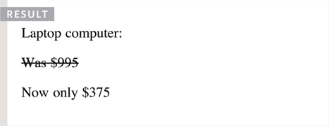

#HTML & CSS: Design and Build Websites


http://www.htmlandcssbook.com/code-samples/
http://www.htmlandcssbook.com/extras/resizing-and-saving-images-for-the-web/

##1. STRUCTURE

###HOW PAGES USE STRUCTURE
Think about the stories you read in a newspaper: for each story, there will be a headline, some text, and possibly some images. If the article is a long piece, there may be subheadings that split the story into separate sections or quotes from those involved. Structure helps readers understand the stories in the newspaper.

The structure is very similar when a news story is viewed online (although it may also feature audio or video). This is illustrated on the right with a copy of a newspaper alongside the corresponding article on its website.


###HTML DESCRIBES THE STRUCTURE OF PAGES

To describe the structure of a web page, we add code to the words we want to appear on the page.

``` html
<html>
  <body>
    <h1>This is the Main Heading</h1>
    <p>This text might be an introduction to the rest of
       the page. And if the page is a long one it might
       be split up into several sub-headings.<p>
    <h2>This is a Sub-Heading</h2>
    <p>Many long articles have sub-headings so to help
       you follow the structure of what is being written.
       There may even be sub-sub-headings (or lower-level
       headings).</p>
    <h2>Another Sub-Heading</h2>
    <p>Here you can see another sub-heading.</p>
  </body>
</html>

```

The HTML code (in blue) is made up of characters that live inside angled brackets — these are called HTML **elements**. Elements are usually made up of two **tags**: an opening tag and a closing tag. (The closing tag has an extra forward slash in it.) Each HTML element tells the browser something about the information that sits between its opening and closing tags.

###HTML USES ELEMENTS TO DESCRIBE THE STRUCTURE OF PAGES

Let's look closer at the code from the last page. There are several different elements. Each element has an opening tag and a closing tag.
####CODE


Tags act like containers. They tell you something about the information that lies between their opening and closing tags.

###SUMMARY STRUCTURE
* HTML pages are text documents
* HTML uses tags (characters that sit inside angled brackets) to give the information they surround special meaning.
* Tags are often referred to as elements.
* Tags usually come in pairs. The opening tag denotes the start of a piece of content; the closing tag denotes the end.
* Opening tags can carry attributes, which tell us more about the content of that element.
* Attributes require a name and a value.
* To learn HTML you need to know what tags are available for you to use, what they do, and where they can go.

##2. TEXT

* **Structural markup**: the elements that you can use to describe both headings and paragraphs
* **Semantic markup**: which provides extra information; such as where emphasis is placed in a sentence, that something you have written is a quotation (and who said it), the meaning of acronyms, and so on

###SEMANTIC MARKUP

There are some text elements that are not intended to affect the structure of your web pages, but they do add extra information to the pages — they are known as semantic markup.

For example, the ```<em>``` element allows you to indicate where emphasis should be placed on selected words and the ```<blockquote>``` element which indicates that a block of text is a quotation.
Browsers often display the contents of these elements in a different way. For example, the content of the ```<em>``` element is shown in italics, and a ```<blockquote>``` is usually indented. But **you should not use them to change the way that your text looks**; their purpose is to **describe the content** of your web pages more accurately.

The reason for using these elements is that other programs, such as screen readers or search engines, can use this extra information. For example, the voice of a screen reader may add emphasis to the words inside the ```<em>``` element, or a search engine might register that your page features a quote if you use the ```<blockquote>``` element.

###STRONG & EMPHASIS

####```<strong>```

The use of the ```<strong>``` element indicates that its content has strong importance. For example, the words contained in this element might be said with strong emphasis.


By default, browsers will show the contents of a ```<strong>``` element in bold.

####```<em>```

The ```<em>``` element indicates emphasis that subtly changes the meaning of a sentence.
By default browsers will show the contents of an ```<em>``` element in italic.


###QUOTATIONS

####```<blockquote>```

The ```<blockquote>``` element is used for longer quotes that take up an entire paragraph. Note how the ```<p>``` element is still used inside the ```<blockquote>``` element.
Browsers tend to indent the contents of the ```<blockquote>``` element, however you should not use this element just to indent a piece of text — rather you should achieve this effect using CSS.

####```<q>```

The ```<q>``` element is used for shorter quotes that sit within a paragraph. Browsers are supposed to put quotes around the ```<q>``` element, however Internet Explorer does not — therefore many people avoid using the ```<q>``` element.
Both elements may **use the ```cite``` attribute** to indicate where the quote is from. Its value should be a URL that will have more information about the source of the quotation.


###ABBREVIATIONS & ACRONYMS

####```<abbr>```

If you use an abbreviation or an acronym, then the ```<abbr>``` element can be used. A ```title``` attribute on the opening tag is used to specify the full term.


###CITATIONS & DEFINITIONS

####```<cite>```

When you are referencing a piece of work such as a book, film or research paper, the ```<cite>``` element can be used to indicate where the citation is from.


In HTML5, ```<cite>``` should not really be used for a person's name — but it was allowed in HTML 4, so most people are likely to continue to use it.
Browsers will render the content of a ```<cite>``` element in italics.

####```<dfn>```

The first time you explain some new terminology (perhaps an academic concept or some jargon) in a document, it is known as the defining instance of it.
The ```<dfn>``` element is used to indicate the defining instance of a new term.
Some browsers show the content of the ```<dfn>``` element in italics. Safari and Chrome do not change its appearance.


###AUTHOR DETAILS

####```<address>``` 

The ```<address>``` element has quite a specific use: to contain contact details for the author of the page.
It can contain a physical address, but it does not have to. For example, it may also contain a phone number or email address.


Browsers often display the content of the ```<address>``` element in italics.

You may also be interested in something called the *hCard* microformat for adding physical address information to your markup.

**ONLINE EXTRA**:
You can find out more about hCards on the website accompanying this book.

###CHANGES TO CONTENT

####```<ins>``` ```<del>```

The ```<ins>``` element can be used to show content that has been inserted into a document, while the ```<del>``` element can show text that has been deleted from it.


####```<s>```

The ```<s>``` element indicates something that is no longer accurate or relevant (but that should not be deleted).
Visually the content of an ```<s>``` element will usually be displayed with a line through the center.
Older versions of HTML had a ```<u>``` element for content that was underlined, but this is being phased out.




###SUMMARY TEXT
* HTML elements are used to describe the structure of the page (e.g. headings, subheadings, paragraphs).
* They also provide semantic information (e.g. where emphasis should be placed, the definition of any acronyms used, when given text is a quotation).

##3. LISTS

* **Ordered lists** (Numbered lists) are lists where each item in the list is numbered. For example, the list might be a set of steps for a recipe that must be performed in order, or a legal contract where each point needs to be identified by a section number.
* **Unordered lists** (Bullet lists) are lists that begin with a bullet point (rather than characters that indicate order).
* **Definition lists** are made up of a set of terms along with the definitions for each of those terms.

####ORDERED LISTS
#####```<ol>```
The ordered list is created with the ```<ol>``` element.
#####```<li>```
Each item in the list is placed between an opening ```<li>``` tag and a closing ```</li>``` tag. (The li stands for list item.)
Browsers indent lists by default.
Sometimes you may see a type attribute used with the ```<ol>``` element to specify the type of bullet point (circles, squares, diamonds and so on). It is better to use the CSS ```list-style-type``` property covered on pages 333-335.

####UNORDERED LISTS
#####```<ul>```
The ordered list is created with the ```<ul>``` element.
#####```<li>```
Each item in the list is placed between an opening ```<li>``` tag and a closing ```</li>``` tag. (The li stands for list item.)
Browsers indent lists by default.
Sometimes you may see a type attribute used with the ```<ul>``` element to specify the type of bullet point (circles, squares, diamonds and so on). It is better to use the CSS ```list-style-type``` property covered on pages 333-335.

####DEFINITION LISTS

#####```<dl>```
The definition list is created with the ```<d1>``` element and usually consists of a series of terms and their definitions.
Inside the ```<d1>``` element you will usually see pairs of ```<dt>``` and ```<dd>``` elements.
#####```<dt>```
This is used to contain the term being defined (the definition term).
#####```<dd>```
This is used to contain the definition.
Sometimes you might see a list where there are two terms used for the same definition or two different definitions for the same term.


####NESTED LISTS


You can put a second list inside an ```<li>``` element to create a sub-list or nested list.
Browsers display nested lists indented further than the parent list. In nested unordered lists, the browser will usually change the style of the bullet point too.

####SUMMARY LISTS
There are three types of HTML lists: **ordered**, **unordered**, and **definition**.
* Ordered lists use numbers.
* Unordered lists use bullets.
* Definition lists are used to define terminology.
* Lists can be nested inside one another.

##4. LINKS

###OPENING LINKS IN A NEW WINDOW
####```target```

If you want a link to open in a new window, you can use the target attribute on the opening ```<a>``` tag. The value of this attribute should be ```_blank```.


One of the most common reasons a web page author might want a link to be opened in a new window is if it points to another website. In such cases, they hope the user will return to the window containing their site after finishing looking at the other one.

Generally you should avoid opening links in a new window, but if you do, it is considered good practice to inform users that the link will open a new window before they click on it.

##5. IMAGES

###CHOOSING IMAGES FOR YOUR SITE

Images can be used to set the tone for a site in less time than it takes to read a description. If you do not have photographs to use on your website, there are companies who sell stock images; these are images you pay to use (there is a list of stock photography websites below). Remember that all images are subject to copyright, and you can get in trouble for simply taking photographs from another website.

####IMAGES SHOULD…
* Be relevant
* Convey information
* Convey the right mood
* Be instantly recognisable
* Fit the color palette

####STOCK PHOTOS
* http://www.istockphoto.com
* http://www.gettyimages.com
* http://www.veer.com
* http://www.sxc.hu
* http://www.fotolia.com

####ONLINE EXTRA
http://www.htmlandcssbook.com/extras/

We have provided an online gallery that helps you choose the right image for your website. You can find it in the tools section of the site accompanying this book.

###HEIGHT & WIDTH OF IMAGES

You will also often see an `````` element use two other attributes that specify its size:


####height
This specifies the height of the image in pixels.

####width
This specifies the width of the image in pixels.

Images often take longer to load than the HTML code that makes up the rest of the page. It is, therefore, a good idea to specify the size of the image so that the browser can render the rest of the text on the page while leaving the right amount of space for the image that is still loading.

The size of images is increasingly being specified using CSS rather than HTML — see pages 409-410 for more information about this.

###WHERE TO PLACE IMAGES IN YOUR CODE

Where an image is placed in the code will affect how it is displayed. Here are three examples of image placement that produce different results:


1. **BEFORE A PARAGRAPH**: The paragraph starts on a new line after the image.
2. **INSIDE THE START OF A PARAGRAPH**: The first row of text aligns with the bottom of the image.
3. **IN THE MIDDLE OF A PARAGRAPH**: The image is placed between the words of the paragraph that it appears in.

Where you place the image in the code is important because browsers show HTML elements in one of two ways:


**Block elements always appear on a new line**. Examples of block elements include the ```<h1>``` and ```<p>``` elements.
If the `````` is followed by a block level element (such as a paragraph) then the block level element will sit on a new line after the imageas shown in the first example on this page.

**Inline elements sit within a block level element and do not start on a new line**. Examples of inline elements include the ```<b>```, ```<em>```, and `````` elements.
If the `````` element is inside a block level element, any text or other inline elements will flow around the image as shown in the second and third examples on this page.
Block and inline elements are discussed in greater depth on pages 185-186.

###OLD CODE: ALIGNING IMAGES HORIZONTALLY AND VERTICALLY

####align
The align attribute was commonly used to indicate how the other parts of a page should flow around an image. It has been removed from HTML5 and new websites should use CSS to control the alignment of images (as you will see on pages 411-412).

###THREE RULES FOR CREATING IMAGES

There are three rules to remember when you are creating images for your website which are summarized below. We go into greater detail on each topic over the next nine pages.

1. **SAVE IMAGES IN THE RIGHT FORMAT**: Websites mainly use images in jpeg, gif, or png format. If you choose the wrong image format then your image might not look as sharp as it should and can make the web page slower to load.

2. **SAVE IMAGES AT THE RIGHT SIZE**: You should save the image at the same width and height it will appear on the website. If the image is smaller than the width or height that you have specified, the image can be distorted and stretched. If the image is larger than the width and height if you have specified, the image will take longer to display on the page.

3. **USE THE CORRECT RESOLUTION**: Computer screens are made up of dots known as pixels. Images used on the web are also made up of tiny dots. Resolution refers to the number of dots per inch, and most computer screens only show web pages at 72 pixels per inch. So saving images at a higher resolution results in images that are larger than necessary and take longer to download.

####TOOLS TO EDIT & SAVE IMAGES

#####SOFTWARES
* Adobe Photoshop
* Adobe Fireworks
* Pixelmator
* PaintShop Pro
* Paint.net

#####ONLINE EDITORS
* http://www.photoshop.com
* http://www.pixlr.com
* http://www.splashup.com
* http://www.ipiccy.com

#####ONLINE EXTRA
Watch videos that demonstrate how to resize images and save them in the correct format using both of these applications.

#####JPEG Images
Whenever you have many different colors in a picture you should use a JPEG. A photograph that features snow or an overcast sky might look like it has large areas that are just white or gray, but the picture is usually made up of many different colors that are subtly different.

#####PNG or GIF images
Use GIF or PNG when saving images with few colors or large areas of the same color.

When a picture has an area that is filled with exactly the same color, it is known as flat color. Logos, illustrations, and diagrams often use flat colors. (Note that photographs of snow, sky, or grass are not flat colors, they are made up of many subtly different shades of the same color and are not as suited to GIF or PNG format.)

####IMAGE DIMENSIONS

The images you use on your website should be saved at the same width and height that you want them to appear on the page.
For example, if you have designed a page to include an image that is 300 pixels wide by 150 pixels tall, the image you use should be 300 × 150 pixels. You may need to use image editing tools to resize and crop the image. When sourcing images, it is important to understand how you can alter the dimensions of an image; imagine that you had designed a web page to include an image that is 300 pixels wide by 150 pixels tall:

#####ONLINE EXTRA
Visit the tools section of the website accompanying this book to watch a video guide to resizing images in Photoshop and GIMP.

#####REDUCING IMAGE SIZE
You can reduce the size of images to create a smaller version of the image.


**Example**: If your image is 600 pixels wide and 300 pixels tall, you can reduce the size of the image by 50%. 

**Result**: This will create an image that is quicker to download.

#####INCREASING IMAGE SIZE
You can't increase the size of photos significantly without affecting the image quality.


**Example**: If your image is only 100 pixels wide by 50 pixels tall, increasing the size by 300% would result in poor quality.

**Result**: The image will look blurry or blocky.

#####CHANGING SHAPE
Only some images can be cropped without losing valuable information (see next page).


**Example**: If your image is 300 pixels square, you can remove parts of it, but in doing so you might lose valuable information.

**Result**: Only some images can be cropped and still make sense.

####IMAGE RESOLUTION
Images created for the web should be saved at a resolution of 72 ppi. The higher the resolution of the image, the larger the size of the file.

JPGs, GIFs, and PNGs belong to a type of image format known as bitmap. They are made up of lots of miniature squares. The resolution of an image is the number of squares that fit within a 1 inch × 1 inch square area.

Images appearing on computer screens are made of tiny squares called pixels. A small segment of this photograph has been magnified to show how it is made up of pixels. The web browsers on most desktop computers display images at a resolution of 72 pixels per inch (ppi). Images in print materials (such as books and magazines) are made up of tiny circles called dots. These images are usually printed at a resolution of 300 dots per inch (dpi).


For this image:
* JPEG at 300 dpi = 1,526kb
* JPEG at 72 ppi = 368kb

Due to the fact that computer displays are capped at a resolution of 72 ppi, using images on the web with a higher resolution will not result in better image quality — only in larger file sizes, which will increase the time needed to load them and therefore slow down viewing of your web pages.

####VECTOR IMAGES
Vector images differ from bitmap images and are resolution-independent. Vector images are commonly created in programs such as Adobe Illustrator.


When an image is a line drawing (such as a logo, illustration, or diagram), designers will often create it in vector format. Vector formatted images are very different to bitmap images.

Vector images are created by placing points on a grid, and drawing lines between those points. A color can then be added to “fill in” the lines that have been created.

The advantage of creating line drawings in vector format is that you can increase the dimensions of the image without affecting the quality of it.

The current method of using vector images for display on websites involves saving a bitmap version of the original vector image and using that.


Scalable Vector Graphics (SVG) are a relatively new format used to display vector images directly on the web (eliminating the need to create bitmap versions of them), however its use is not yet widespread.

####TRANSPARENCY

Creating an image that is partially transparent (or “see-through”) for the web involves selecting one of two formats:

#####TRANSPARENT GIF
If the transparent part of the image has straight edges and it is 100% transparent (that is, not semi-opaque), you can save the image as a GIF (with the transparency option selected).

#####PNG
If the transparent part of the image has diagonal or rounded edges or if you want a semi-opaque transparency or a drop-shadow, then you will need to save it as a PNG.
Transparent PNGs are not fully supported in older browsers, most notably Internet Explorer 6 (IE6). There is some JavaScript you can use to get around this issue. The details of this script can be found in the tools section of the website accompanying this book.


####HTML5: FIGURE AND FIGURE CAPTION
#####```<figure>```
Images often come with captions. HTML5 has introduced a new ```<figure>``` element to contain images and their caption so that the two are associated.


You can have more than one image inside the ```<figure>``` element as long as they all share the same caption.

```<figcaption>```
The ```<figcaption>``` element has been added to HTML5 in order to allow web page authors to add a caption to an image.
Before these elements were created there was no way to associate an `````` element with its caption.
Older browsers that do not understand HTML5 elements simply ignore the new elements and display the content of them.
In this example, the logo is a GIF because it uses flat colors, while the photographs are JPEGs. The main photo is placed inside the HTML5 ```<figure>``` element and has its own caption.
The alt attribute on each image provides a description for those using screen readers and the title attribute provides additional information. (This is shown in the tooltip.)
This example does not use the ```height```, ```width```, or ```align``` attributes as these are being phased out and you are encouraged to use CSS properties instead.

###SUMMARY IMAGES
The `````` element is used to add images to a web page.
You must always specify a src attribute to indicate the source of an image and an alt attribute to describe the content of an image.
You should save images at the size you will be using them on the web page and in the appropriate format.
Photographs are best saved as JPEGs; illustrations or logos that use flat colors are better saved as GIFs.