##12. TEXT

The properties that allow you to control the appearance of text can be split into two groups:

* Those that directly affect the font and its appearance (including the typeface, whether it is regular, bold or italic, and the size of the text)
* Those that would have the same effect on text no matter what font you were using (including the color of text and the spacing between words and letters)

###TYPEFACE TERMINOLOGY

####SERIF
Serif fonts have extra details on the ends of the main strokes of the letters. These details are known as serifs.

In print, serif fonts were traditionally used for long passages of text because they were considered easier to read.


####SANS-SERIF
Sans-serif fonts have straight ends to letters, and therefore have a much cleaner design.

Screens have a lower resolution than print. So, if the text is small, sans-serif fonts can be clearer to read.


####MONOSPACE
Every letter in a monospace (or fixed-width) font is the same width. (Non-monospace fonts have different widths.)


Monospace fonts are commonly used for code because they align nicely, making the text easier to follow.

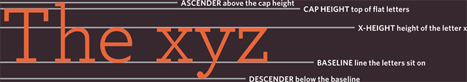

####WEIGHT
The font weight not only adds **emphasis** but can also affect the amount of **white space** and **contrast** on a page.

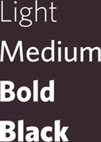

####STYLE
**Italic** fonts have a cursive aspect to some of the lettering. **Oblique** font styles take the normal style and put it on an angle.

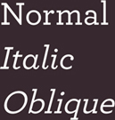

####STRETCH
In condensed (or narrow) versions of the font, letters are thinner and closer together. In expanded versions they are thicker and further apart.

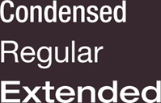

###CHOOSING A TYPEFACE FOR YOUR WEBSITE

####SERIF
Serif fonts have extra details on the end of the main strokes of the letters.

EXAMPLES:
* Georgia
* Times
* Times New Roman

####SANS-SERIF
Sans-serif fonts have straight ends to letters and therefore have a much cleaner design.

EXAMPLES:
* Arial
* Verdana
* Helvetica

It is possible to specify more than one typeface and create an order of preference (in case the user does not have your first choice of typeface installed). This is sometimes referred to as a font stack.

####MONOSPACE
Every letter in a monospace typeface is the same width. (Non-monospace fonts have different widths.)

EXAMPLES:


####CURSIVE
Cursive fonts either have joining strokes or other cursive characteristics, such as handwriting styles.

EXAMPLES:


####FANTASY
Fantasy fonts are usually decorative fonts and are often used for titles. They're not designed for long bodies of text.

EXAMPLES:


Browsers are supposed to support at least one typeface from each of the groups above. For this reason, it is common to add the generic font name after your preferred choice of typefaces.

For example, if you wanted serif type, you could write the following:

```font-family: Georgia, Times, serif;```

###TECHNIQUES THAT OFFER A WIDER CHOICE OF TYPEFACES

There are several ways to use fonts other than those listed on the previous page. However, typefaces are subject to copyright, so the techniques you can choose from are limited by their respective licenses.

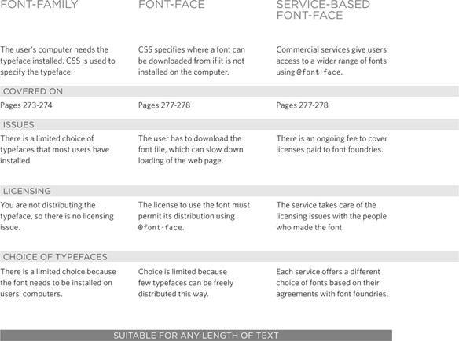

---

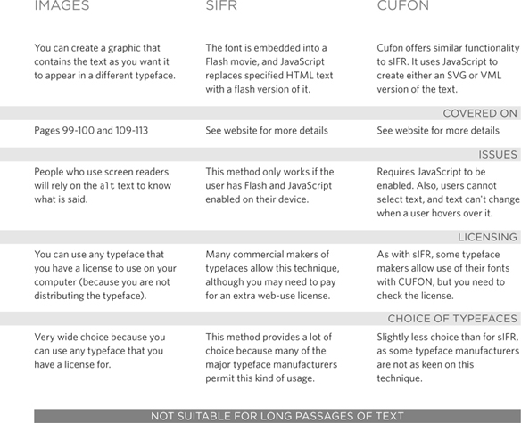

###SPECIFYING TYPEFACES

**```font-family```**

The ```font-family``` property allows you to specify the typeface that should be used for any text inside the element(s) to which a CSS rule applies.

The people who are visiting your site need the typeface you have specified installed on their computer in order for it to be displayed.

You can specify a list of fonts separated by commas so that, if the user does not have your first choice of typeface installed, the browser can try to use an alternative font from the list.

It is also common to end with a generic font name for that type of font.

If a font name is made up of **more than one word**, it should be put in **double quotes**.

Designers suggest pages usually look better if they **use no more than three typefaces on a page**.

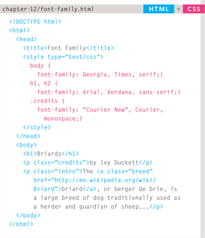
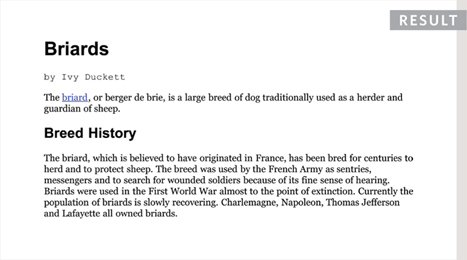

###SIZE OF TYPE

**```font-size```**

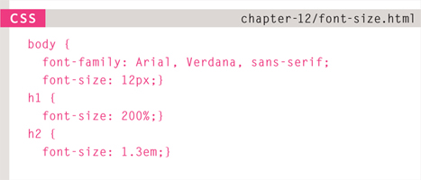
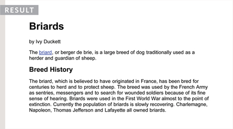

The font-size property enables you to specify a size for the font. There are several ways to specify the size of a font. The most common are:

**PIXELS**

Pixels are commonly used because they allow web designers very precise control over how much space their text takes up. The number of pixels is followed by the letters px.

**PERCENTAGES**

The default size of text in browsers is 16px. So a size of 75% would be the equivalent of 12px, and 200% would be 32px.
If you create a rule to make all text inside the ```<body>``` element to be 75% of the default size (to make it 12px), and then specify another rule that indicates the content of an element inside the ```<body>``` element should be 75% size, it will be 9px (75% of the 12px font size).

**EMS**

An em is equivalent to the width of a letter **```m```**.

####TYPE SCALES

You may have noticed that programs such as Word, Photoshop and InDesign offer the same sizes of text.

This is because they are set according to a scale or ratio that was developed by European typographers in the sixteenth century.
It is considered that this scale for type is pleasing to the eye and it has therefore changed little in the last 400 years.

For this reason, when you are designing pages, using sizes from this scale will help them look more attractive.

On the next page, you can see how to achieve this scale using pixels, percentages, and ems.

Print designers often refer to the size of text in terms of points rather than pixels (hence the use of pt in the scale on the right). A pixel roughly equates to a point because a point corresponds to 1/72 of an inch, and most computer displays have a resolution of 72 dots per inch.

The default size of text in a browser is 16 pixels. So if you use percentages or ems, you calculate the size of text you want based on the default size of the text used in browsers. For example, you could scale down to 12 pixels for body copy and scale up to 24 pixels for headings.

Recently, some web designers have started to leave the body text at the default size of 16 pixels and adjust the other font sizes using a scale that keeps the relative proportions of this one.

When you first see body text at 16 pixels, it might seem quite large. Once you get used to the larger type, however, most people find it far easier to read; and going back to a page where main type is 12 pixels will often then look quite small.

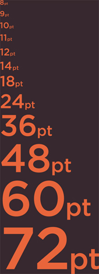

###UNITS OF TYPE SIZE

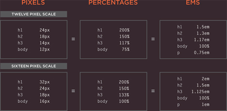

Setting font size in pixels is the best way to ensure that the type appears at the size you intended (because percentages and ems are more likely to vary if a user has changed the default size of text in their browser).

Pixels are relative to the resolution of the screen, so the same type size will look larger when a screen has a resolution of 800×600 than it would when it is 1280×800.

You can also use **pt for point** sizes instead of px for pixels, but you should only do this when creating style sheets for **printer-friendly** versions of pages.

The **default size** of text in a web browser is **16 pixels**. Using percentages of this amount, you can create a scale where the default text size is 12 pixels, and headings are sized in relation to this.

It is possible for users to change the default size of text in their web browsers. If they have done this, the fonts will be displayed at the same scale that the designer intended, but at a larger size.

**```Ems```** allow you to change the size of text relative to the size of the text in the parent element. Since the default size of text in web browsers is 16 pixels, you can use similar rules to those shown for percentages.

Because users can change the default size of text in their browser, the fonts could all appear larger (or smaller) than the designer intended.

###MORE FONT CHOICE

**```@font-face```**

```@font-face``` allows you to use a font, even if it is not installed on the computer of the person browsing, by allowing you to specify a path to a copy of the font, which will be downloaded if it is not on the user's machine.

**```font-family```**

This specifies the name of the font. This name can then be used as a value of the font-family property in the rest of the style sheet (as shown in the rule for the ```<h1>``` and ```<h2>``` elements).

**```src```**

This specifies the path to the font. In order for this technique to work in all browsers, you will probably need to specify paths to a few different versions of the font.

**```format```**

This specifies the format that the font is supplied in.

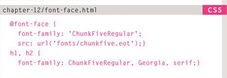
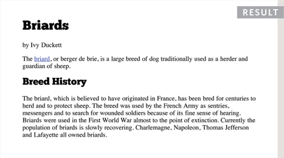

Many typeface makers do not allow you to use their fonts in this way, but there are open source fonts you can use freely. You can find lists of them at:
* http://www.fontsquirrel.com
* http://www.fontex.org
* http://www.openfontlibrary.org

When looking at fonts on these sites, it is still important to check the font's license agreement because some fonts are only free for personal use (that is, not for use on commercial websites).

There are some sites that give you access to use commercial fonts, because they negotiated permission to let their customers use these fonts for a fee:
* http://www.typekit.com
* http://www.kernest.com
* http://www.fontspring.com

**Google** also provides **open source fonts**. Rather than adding the ```font-face``` rule to your own style sheet, you link to a CSS file and font files on their servers: http://fonts.google.com

###UNDERSTANDING FONT FORMATS

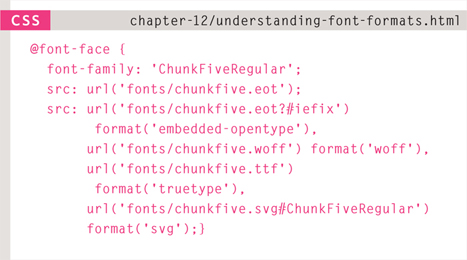
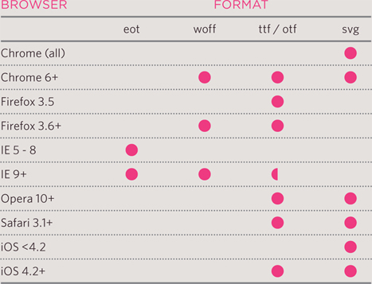

Because the browser needs to download the font file in order to show it, users might see something known as a Flash of Unstyled Content (FOUC) or Flash of Unstyled Text (FOUT). Two things you can do to try to minimize this behavior are to delete any unneccesary glyphs from the font and/or host the font on a Content Delivery Network (a special type of web hosting that offers faster delivery of files).

Different browsers support different formats for fonts (in the same way that they support different audio and video formats), so you will need to supply the font in several variations to reach all browsers.

If you do not have all of these formats for your font, you can upload the font to a website called FontSquirrel where they will convert it for you:
http://www.fontsquirrel.com/fontface/generator

Font Squirrel also provides you with the CSS code for the @font-face rule. This is very helpful because, when you are dealing with multiple font formats, the src and format properties of the ```@font-face``` rule can get rather complicated.

The various font formats should appear in your code in this order:
1. eot
2. woff
3. ttf/otf
4. svg

###BOLD

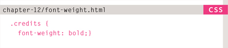
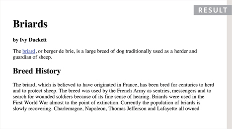

####```font-weight```
The font-weight property allows you to create bold text. There are two values that this property commonly takes:

**```normal```**

This causes text to appear at a normal weight.

**```bold```**

This causes text to appear bold.
In this example, you can see that the element whose class attribute has a value of credits has been bolded.

You might wonder why there is a normal weight. This is because if, for example, you created a rule for the ```<body>``` element indicating that all text inside the body should appear bold, you might need an option that allows the text in certain instances to appear normal weight. So it is essentially used as an “off switch.”

###ITALIC
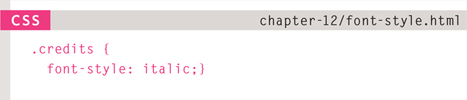
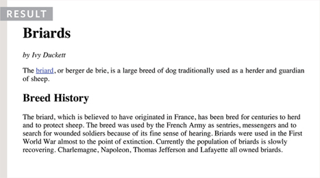

####```font-style```
If you want to create italic text, you can use the ```font-style``` property. There are three values this property can take:

**```normal```**

This causes text to appear in a normal style (as opposed to italic or oblique).

**```italic```**

This causes text to appear italic.

**```oblique```**

This causes text to appear oblique.

Italic fonts were traditionally stylized versions of the font based on calligraphy, whereas an oblique version would take the normal version and put it on an angle.

It is not unusual for the browser to fail to find an italic version of a typeface, in which case it will use an algorithm to place the normal version of the type on a slant, which means that a lot of italic text online is actually oblique.

###UPPERCASE & LOWERCASE

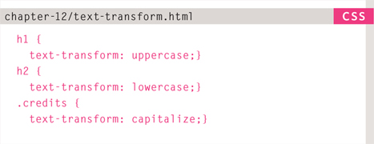
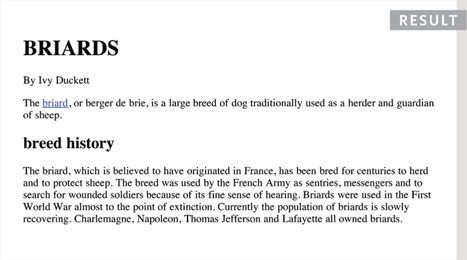

####```text-transform```
The ```text-transform``` property is used to change the case of text giving it one of the following values:

**```uppercase```** - This causes the text to appear uppercase.

**```lowercase```** - This causes the text to appear lowercase.

**```capitalize```** - This causes the first letter of each word to appear capitalized.

In this example, the ```<h1>``` element is uppercase, the ```<h2>``` element is lowercase, and the credits are capitalized. In the HTML, the word by in the credits had a lowercase b.

If you do utilize the uppercase option, it is worth looking at the letter-spacing property to increase the gap between each letter as shown on page 284. This will help improve readability.

###UNDERLINE & STRIKE

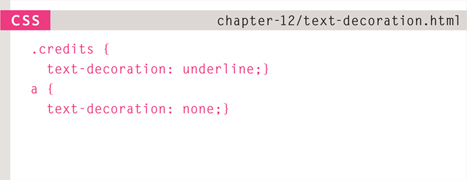
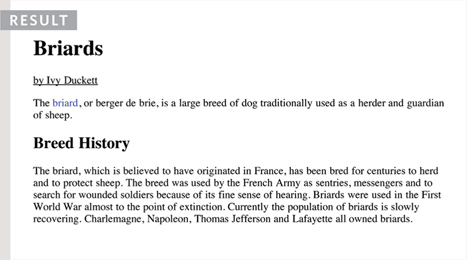

####```text-decoration```
The ```text-decoration``` property allows you to specify the following values:

**```none```** - This removes any decoration already applied to the text.

**```underline```** - This adds a line underneath the text.

**```overline```** - This adds a line over the top of the text.

**```line-through```** - This adds a line through words.

**```blink```** - This animates the text to make it flash on and off (however this is generally frowned upon, as it is considered rather annoying).

In this example, the credits have been underlined. Also, the name of the breed (which is a link) is not underlined, which it would be by default because it is a link. This property is commonly used by designers to remove the underlines that browsers place under links. 

###LEADING

Leading (pronounced *ledding*) is a term typographers use for the vertical space between lines of text. In a typeface, the part of a letter that drops beneath the baseline is called a **descender**, while the highest point of a letter is called the **ascender**. Leading is measured from the bottom of the descender on one line to the top of the ascender on the next.

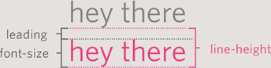

####```line-height```
In CSS, the ```line-height``` property sets the height of an entire line of text, so the difference between the font-size and the line-height is equivalent to the leading (as shown in the diagram above).

Increasing the line-height makes the vertical gap between lines of text larger.

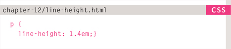
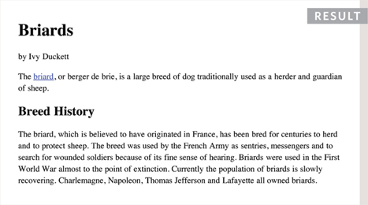
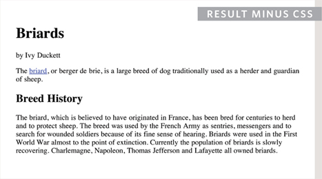

Increasing the default amount of leading can make text easier to read. **The vertical space between lines should be larger than the space between each word as this helps the eye move along the line instead of down them**. 

A good starter setting is around 1.4 to 1.5em. Because users can adjust the default size of text in their browser, the value of the ```line-height``` property is best given in ```ems```, not pixels, so that the gap between lines is relative to the size of text the user has selected.

###LETTER & WORD SPACING

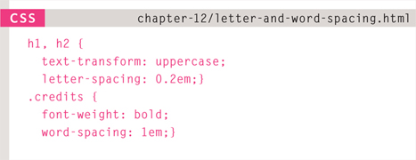
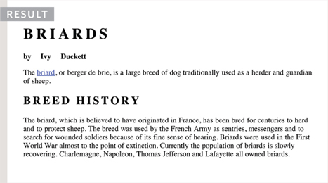
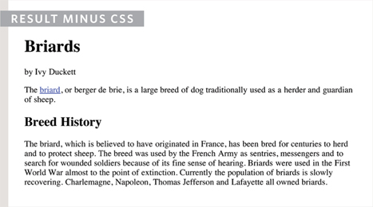

####```letter-spacing```, ```word-spacing```

**Kerning** is the term typographers use for the space between each letter. You can control the space between each letter with the ```letter-spacing``` property.

**It is particularly helpful to increase the kerning when your heading or sentence is all in uppercase. If your text is in sentence (or normal) case, increasing or decreasing the kerning can make it harder to read.**

You can also control the gap between words using the ```word-spacing``` property.

When you specify a value for these properties, it should be given in ems, and it will be added on top of the default value specified by the font.

The default gap between words is set by the typeface (often around 0.25em), and it is unlikely that you would need to change this property regularly. If the typeface is bold or you have increased the space between letters, then a larger gap between words can increase readability.

###ALIGNMENT

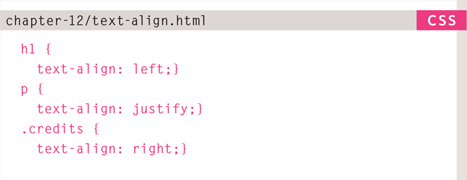
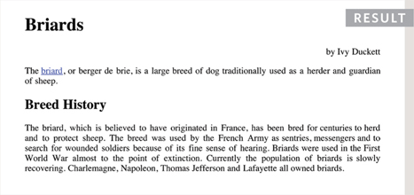

####```text-align```
The text-align property allows you to control the alignment of text. The property can take one of four values:

**```left```** - This indicates that the text should be left-aligned.

**```right```** - This indicates that the text should be right-aligned.

**```center```** - This allows you to center text.

**```justify```** - This indicates that every line in a paragraph, except the last line, should be set to take up the full width of the containing box.

When you have several paragraphs of text, it is considered easiest to read if the text is left-aligned.

Justified text looks at the words on each individual line and creates an equal gap between those words. It can look odd if you end up with large gaps between some words and smaller gaps between others. This often happens when your lines are not very wide or when your text contains long words.

###VERTICAL ALIGNMENT

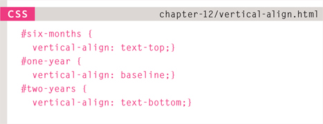
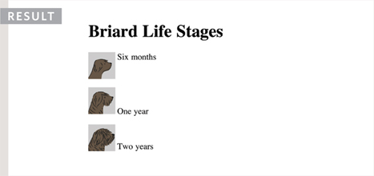

####```vertical-align```

The ```vertical-align``` property is a common source of confusion. It is not intended to allow you to vertically align text in the middle of block level elements such as ```<p>``` and ```<div>```, although it does have this effect when used with table cells (the ```<td>``` and ```<th>``` elements).

It is more commonly used with inline elements such as ``````, ```<em>```, or ```<strong>``` elements. When used with these elements, it performs a task very similar to the HTML ali gn attribute used on the `````` element, which you met on pages 103-106. The values it can take are:
* baseline
* sub
* super
* top
* text-top
* middle
* bottom
* text-bottom

It can also take a **length** (usually specified in pixels or ems) or a **percentage** of the line height.

###INDENTING TEXT

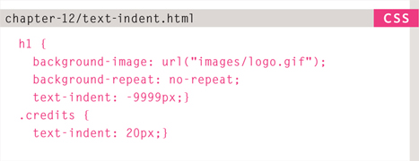
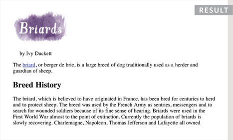

####```text-ident```

The ```text-indent``` property allows you to indent the first line of text within an element. The amount you want the line indented by can be specified in a number of ways but is usually given in pixels or ems.

It can take a negative value, which means it can be used to push text off the browser window. You can see this technique used in this example, where the ```<h1>``` element uses a background image to represent the heading. The text has been moved far to the left, off the screen.

We still want the heading text to be on the page (for search engines and those who cannot see the image), but we cannot have it displayed on top of the logo or it will be unreadable. By pushing it 9,999 pixels to the left, it is way out of sight but still in the HTML code.

The second rule in this example indents the credits 20 pixels to the right.

###CSS3: DROP SHADOW

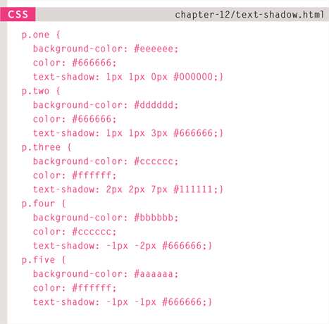
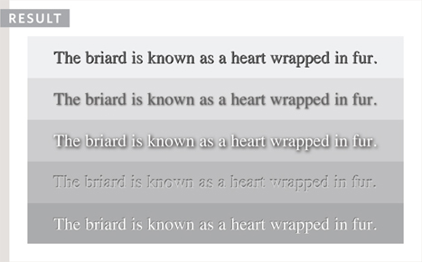

####```text-shadow```

It is used to create a drop shadow, which is a dark version of the word just behind it and slightly offset. It can also be used to create an embossed effect by adding a shadow that is slightlylighter than the text.

The value of this property is quite complicated because it can take three lengths and a color for the drop shadow:

* The first length indicates how far to the left or right the shadow should fall.
* The second value indicates the distance to the top or bottom that the shadow should fall.
* The third value is optional and specifies the amount of blur that should be applied to the drop shadow.
* The fourth value is the color of the drop shadow.

###FIRST LETTER OR LINE

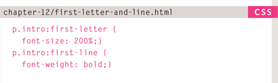
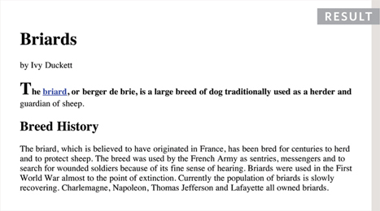

####```:first-letter```, ```:first-line```

Technically these are not properties. They are known as **pseudo-elements**.

You specify the pseudo-element at the end of the selector, and then specify the declarations as you would normally for any other element.

CSS introduces both **pseudo-elements** and **pseudo-classes**. A pseudo-element acts like an extra element is in the code. In the case of the ```:first-letter``` and ```:first-line``` **pseudo elements**, it is as if there is an extra element around the first letter or the first line which can have its own styles applied.

A **pseudo-class** acts like an extra value for a class attribute. In the case of the ```:visited``` **pseudo-class** it allows you to have different styles for links that have been visited. Similarly, the ```:hover``` **pseudo-class** allows you to style elements differently when a user hovers over them.

###STYLING LINKS

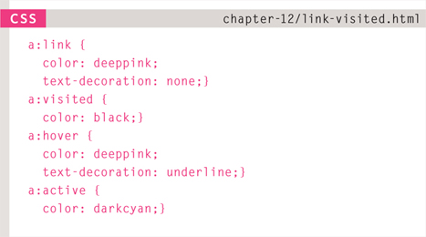
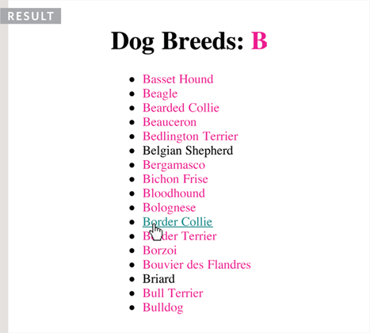

####```:link```, ```:visited```

Browsers tend to show links in blue with an underline by default, and they will change the color of links that have been visited to help users know which pages they have been to.

In CSS, there are two **pseudo-classes** that allow you to set different styles for links that have and have not yet been visited.

**```:link```** - This allows you to set styles for links that have not yet been visited.

**```:visited```** - This allows you to set styles for links that have been clicked on.

###RESPONDING TO USERS

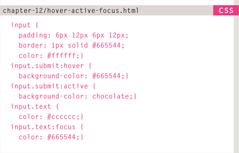
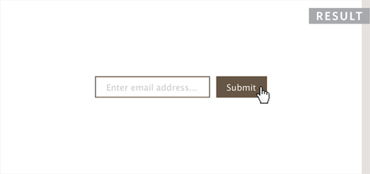

####```:hover```, ```:active```, ```:focus```

There are three pseudo-classes that allow you to change the appearance of elements when a user is interacting with them.

**```:hover```** - This is applied when a user hovers over an element with a pointing device such as a mouse. This has commonly been used to change the appearance of links and buttons when a user places their cursor over them. It is worth noting that such events do not work on devices that use touch screens (such as the iPad) because the screen is not able to tell when someone is hovering their finger over an element.

**```:active```** - This is applied when an element is being activated by a user; for example, when a button is being pressed or a link being clicked. Sometimes this is used to make a button or link feel more like it is being pressed by changing the style or position of the element slightly.

**```:focus```** - This is applied when an element has focus. Any element that you can interact with, such as a link you can click on or any form control can have focus.

Focus occurs when a browser discovers that you are ready to interact with an element on the page. For example, when your cursor is in a form input ready to accept typing, that element is said to have focus. It is also possible to use the tab key on your keyboard to move through the interactive items on a page. 

When pseudo-classes are used, they should appear in this order: 
1. ```:link``` 
2. ```:visited```
3. ```:hover```
4. ```:focus```
5. ```:active```

### ATTRIBUTE SELECTORS

There are also a set of attribute selectors that allow you to create rules that apply to elements that have an attribute with a specific value.

### SUMMARY TEXT
* There are properties to control the choice of font, size, weight, style, and spacing.
* There is a limited choice of fonts that you can assume most people will have installed.
* If you want to use a wider range of typefaces there are several options, but you need to have the right license to use them.
* You can control the space between lines of text, individual letters, and words. Text can also be aligned to the left, right, center, or justified. It can also be indented.
* You can use pseudo-classes to change the style of an element when a user hovers over or clicks on text, or when they have visited a link.

## 13. BOXES

### BOX DIMENSIONS

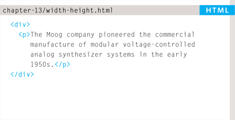
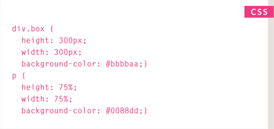
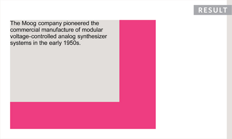

####```width```, ```height```

By default a box is sized just big enough to hold its contents. To set your own dimensions for a box you can use the height and width properties.

The most popular ways to specify the size of a box are to use pixels, percentages, or ems. 

Traditionally, **pixels** have been the most popular method because they allow designers to accurately control their size.

When you use **percentages**, the size of the box is relative to the size of the browser window or, if the box is encased within another box, it is a percentage of the size of the containing box.

When you use **ems**, the size of the box is based on the size of text within it. Designers have recently started to use percentages and ems more for measurements as they try to create designs that are flexible across devices which have different-sized screens.

In the example, you can see that a containing ```<div>``` element is used which is 300 pixels wide by 300 pixels high. Inside of this is a paragraph that is 75% of the width and height of the containing element. This means that the size of the paragraph is 225 pixels wide by 225 pixels high.

### LIMITING WIDTH

#### ```min-width```, ```max-width```

Some page designs expand and shrink to fit the size of the user's screen. In such designs, the min-width property specifies the smallest size a box can be displayed at when the browser window is narrow, and the max-width property indicates the maximum width a box can stretch to when the browser window is wide.

You can use the max-width property to ensure that lines of text do not appear too wide within a big browser window and you can use the min-width property to make sure that they do not appear too narrow

### LIMITING HEIGHT

#### ```min-height```, ```max-height```

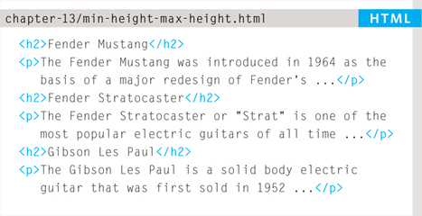
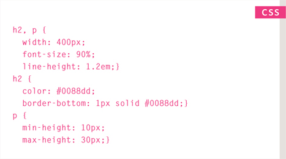


The example on this page demonstrates these properties in action. It also shows you what happens when the content of the box takes up more space than the size specified for the box.

If the box is not big enough to hold the content, and the content expands outside the box it can look very messy. To control what happens when there is not enough space for the content of a box, you can use the **overflow** property.

### OVERFLOWING CONTENT

#### ```overflow```


The ```overflow``` property tells the browser what to do if the content contained within a box is larger than the box itself. It can have one of two values:

**```hidden```** - This property simply hides any extra content that does not fit in the box.

**```scroll```** - This property adds a scrollbar to the box so that users can scroll to see the missing content.

The overflow property is particularly handy because some browsers allow users to adjust the size of the text to appear as large or as small as they want. If the text is set too large then the page can become an unreadable mess. Hiding the overflow on such boxes helps prevent items overlapping on the page.

## BORDER, MARGIN & PADDING

Every box has three available properties that can be adjusted to control its appearance:

 **BORDER** - Every box has a border (even if it is not visible or is specified to be 0 pixels wide). The border separates the edge of one box from another.

 **MARGIN** - Margins sit outside the edge of the border. You can set the width of a margin to create a gap between the borders of two adjacent boxes.

 **PADDING** - Padding is the space between the border of a box and any content contained within it. Adding padding can increase the readability of its contents.

If you specify a width for a box, then the **borders**, **margin**, and **padding** are **added** to its **width** and **height**.


## WHITE SPACE & VERTICAL MARGIN


The ```padding``` and ```margin``` properties are very helpful in adding space between various items on the page

Designers refer to the space between items on a page as white space. Imagine you had a border around a box. You would not want the text to touch this border or it would become harder to read.

Or, imagine you had two boxes sitting side by side (each with a black border). You would not necessarily want the boxes to touch edges as this would make the line look twice as thick on the facing sides.

If the bottom margin of any box touches the top margin of another, the browser will render it differently than you might expect. It will only show the larger of the two margins. If both margins are the same size, it will only show one.

### BORDER WIDTH

#### ```border-width```

The ```border-width``` property is used to control the width of a border. The value of this property can either be given in pixels or using one of the following values:

* thin
* medium
* thick

**(You cannot use percentages with this property.)**

You can control the individual size of borders using four separate properties:
* border-top-width
* border-right-width
* border-bottom-width
* border-left-width

You can also specify different widths for the four border values in one property, like so:
```border-width: 2px 1px 1px 2px;```

The values here appear in clockwise order: top, right, bottom, left.

### BORDER STYLE

#### ```border-style```


You can control the style of a border using the border-style property. This property can take the following values:

* **solid** a single solid line
* **dotted** a series of square dots (if your border is 2px wide, then the dots are 2px squared with a 2px gap between each dot)
* **dashed** a series of short lines
* **double** two solid lines (the value of the border-width property creates the sum of the two lines)
* **groove** appears to be carved into the page
* **ridge** appears to stick out from the page
* **inset** appears embedded into the page
* **outset** looks like it is coming out of the screen
* **hidden / none** no border is shown
You can individually change the styles of different borders using:
* **border-top-style**
* **border-left-style**
* **border-right-style**
* **border-bottom-style**

### BORDER COLOR

#### ```border-color```
You can specify the color of a border using either RGB values, hex codes or CSS color names (as you saw on pages 251-252).

It is possible to individually control the colors of the borders on different sides of a box using:
* border-top-color
* border-right-color
* border-bottom-color
* border-left-color

It is also possible to use a shorthand to control all four border colors in the one property:
```border-color: darkcyan deeppink darkcyan deeppink;```

The values here appear in clockwise order: top, right, bottom, left.
You could also use HSL values to specify the color. However, these were only introduced in CSS3 and will not work in older browsers.

### SHORTHAND

#### ```border```


The border property allows you to specify the ```width```, ```style``` and ```color``` of a border in one property (and the values should be coded in that specific order).

### PADDING

#### ```padding```


The padding property allows you to specify how much space should appear between the content of an element and its border.

The value of this property is most often specified in pixels (although it is also possible to use percentages or ems). If a percentage is used, the padding is a percentage of the browser window (or of the containing box if it is inside another box).

Please note: If a width is specified for a box, padding is added onto the width of the box.

You can specify different values for each side of a box using:
* padding-top
* padding-right
* padding-bottom
* padding-left

Or you can use a shorthand (where the values are in clockwise order: top, right, bottom, left):
```padding: 10px 5px 3px 1px;```

The value of the padding property is not inherited by child elements in the same way that the color value of the font-family property is; so you need to specify the padding for every element that needs to use it.

Up until Internet Explorer 6, the width of the box would include the padding and margins.

### MARGIN

#### ```margin```


 

The value of the ```margin``` property is not inherited by child elements in the same way that the color value of the font-family property is, so you need to specify the ```margin``` for every element that needs to use it.

Up until Internet Explorer 6, the width of the box would include the padding and margins.

The margin property controls the gap between boxes. Its value is commonly given in pixels, although you may also use percentages or ems.

If one box sits on top of another, margins are collapsed, which means the larger of the two margins will be used and the smaller will be disregarded.

Please note: If the width of a box is specified then the margin is added to the width of the box.

You can specify values for each side of a box using:
* margin-top
* margin-right
* margin-bottom
* margin-left

You can also use the shorthand (where the values are in clockwise order: top, right, bottom, left):
```margin: 1px 2px 3px 4px;```

Sometimes you might see the following, which means that the left and right margins should be 10 pixels and the top and bottom margins should be 20 pixels: ```margin: 10px 20px;```

(This same shorthand shown above can also be applied to padding.)

### CENTERING CONTENT

If you want to center a box on the page (or center it inside the element that it sits in), you can set the ```left-margin``` and ```right-margin``` to **auto**.

In order to center a box on the page, you need to set a width for the box (otherwise it will take up the full width of the page).

Once you have specified the width of the box, setting the left and right margins to auto will make the browser put an equal gap on each side of the box. This centers the box on the page (or within the element that the box sits inside).

In order for this to work in older browsers (particularly IE6), the element that the box sits inside should have a ```text-align``` property with its value set to center.

The ```text-align``` property is inherited by child elements. You therefore also need to specify the ```text-align``` property on the centered box if you do not want the text inside it to be centered.


 

### CHANGE INLINE/BLOCK

#### ```display```

The display property allows you to turn an inline element into a block-level element or vice versa, and can also be used to hide an element from the page.

The values this property can take are:

* **inline** - This causes a block-level element to act like an inline element.
* **block** - This causes an inline element to act like a block-level element.
* **inline-block** - This causes a block-level element to flow like an inline element, while retaining other features of a block-level element.
* **none** - This hides an element from the page. In this case, the element acts as though it is not on the page at all (although a user could still see the content of the box if they used the view source option in their browser).

If you use this property, it is important to note that inline boxes are **not** supposed to create block-level elements.

### HIDING BOXES

#### ```visibility```

The ```visibility``` property allows you to hide boxes from users but It leaves a space where the element would have been.
This property can take two values:

**hidden** - This hides the element

**visible** - This shows the element.

If the ```visibility``` of an element is set to hidden, a blank space will appear in its place.
If you do not want a blank space to appear, then you should use the display property with a value of none instead.

### CSS3: BOX SHADOWS

#### ```box-shadow```


 

The box-shadow property allows you to add a drop shadow around a box. It works just like the text-shadow property. It must use at least the first of these two values as well as a color:

HORIZONTAL OFFSET

Negative values position the shadow to the left of the box.

VERTICAL OFFSET

Negative values position the shadow to the top of the box.

BLUR DISTANCE

If omitted, the shadow is a solid line like a border.

SPREAD OF SHADOW

If used, a positive value will cause the shadow to expand in all directions, and a negative value will make it contract.

The **```inset```** keyword can also be used before these values to create an inner-shadow.

Chrome, Firefox, and Safari were quick to support this property using the -moz-box-shadow and -webkit-box-shadow properties. These are not in the CSS specification but using them can help this style to work in these browsers.

### CSS3: ROUNDED CORNERS

#### ```border-radius```

CSS3 introduces the ability to create rounded corners on any box, using a property called border-radius. The value indicates the size of the radius in pixels.

Older browsers that do not support this property will show a box with right-angled corners.

The ```-moz-border-radius``` and ```-webkit-border-radius``` properties are not in the CSS specification. However, they are used in some versions of Chrome, Firefox, and Safari to offer early support for this style (and therefore can be used to achieve this effect in more browsers).

You can specify individual values for each corner of a box using:
* border-top-right-radius
* border-bottom-right-radius
* border-bottom-left-radius
* border-top-left-radius

You can also use a shorthand of these four properties (in clockwise order: top, right, bottom, left). For example:
```border-radius: 5px, 10px, 5px, 10px;```

### SUMMARY BOXES
* CSS treats each HTML element as if it has its own box.
* You can use CSS to control the dimensions of a box.
* You can also control the borders, margin and padding for each box with CSS.
* It is possible to hide elements using the display and visibility properties.
* Block-level boxes can be made into inline boxes, and inline boxes made into block-level boxes.
* Legibility can be improved by controlling the width of boxes containing text and the leading.
* CSS3 has introduced the ability to create image borders and rounded borders.

## 14. LISTS, TABLES AND FORMS

## 15. LAYOUT

### BUILDING BLOCKS
CSS treats each HTML element as if it is in its own box. This box will either be a **block-level** box or an **inline** box.

Block-level boxes start on a new line and act as the main building blocks of any layout, while inline boxes flow between surrounding text. You can control how much space each box takes up by setting the width of the boxes (and sometimes the height, too). To separate boxes, you can use borders, margins, padding, and background colors.

#### BLOCK-LEVEL ELEMENTS - START ON A NEW LINE

Examples include:
```<h1>``` ```<p>``` ```<ul>``` ```<li>```


#### INLINE ELEMENTS FLOW IN BETWEEN SURROUNDING TEXT
Examples include:
`````` ```<b>``` ```<i>```


### CONTAINING ELEMENTS

If one block-level element sits inside another block-level element then the outer box is known as the **containing** or **parent** element.

It is common to group a number of elements together inside a ```<div>``` (or other block-level) element. For example, you might group together all of the elements that form the header of a site (such as the logo and the main navigation). The ```<div>``` element that contains this group of elements is then referred to as the **containing** element.


A box may be nested inside several other block-level elements. The containing element is always the **direct parent** of that element.

The orange lines in this diagram represent ```<div>``` elements. The header (containing the logo and navigation) are in one ```<div>``` element, the main content of the page is in another, and the footer is in a third. The ```<body>``` element is the containing element for these three ```<div>``` elements. The second ```<div>``` element is the containing element for two paragraphs of Latin text and images (represented by crossed squares)

### CONTROLLING THE POSITION OF ELEMENTS

CSS has the following positioning schemes that allow you to control the layout of a page: **normal flow**, **relative positioning**, and **absolute positioning**. You specify the positioning scheme using the position property in CSS. You can also **float elements** using the ```float``` property.

#### NORMAL FLOW
Every block-level element appears on a new line, causing each item to appear lower down the page than the previous one. Even if you specify the width of the boxes and there is space for two elements to sit side-by-side, they will not appear next to each other. This is the default behavior (unless you tell the browser to do something else).


The paragraphs appear one after the other, vertically down the page.

#### RELATIVE POSITIONING
This moves an element from the position it would be in normal flow, shifting it to the top, right, bottom, or left of where it would have been placed. This does not affect the position of surrounding elements; they stay in the position they would be in in normal flow.


The second paragraph has been pushed down and right from where it would otherwise have been in normal flow. 

#### ABSOLUTE POSITIONING

This positions the element in relation to its containing element. It is taken out of normal flow, meaning that it does not affect the position of any surrounding elements (as they simply ignore the space it would have taken up). Absolutely positioned elements move as users scroll up and down the page.


The heading is positioned to the top right, and the paragraphs start at the top of the screen (as if the heading were not there).

To indicate where a box should be positioned, you may also need to use box offset properties to tell the browser how far from the top or bottom and left or right it should be placed. (You will meet these when we introduce the positioning schemes on the following pages.)

#### FIXED POSITIONING

This is a form of absolute positioning that **positions** the element **in relation to** the **browser window**, as opposed to the containing element. Elements with fixed positioning do not affect the position of surrounding elements and they do not move when the user scrolls up or down the page.


The heading has been placed in the center of the page and 25% from the top of the screen. (The rest appears in normal flow.)

#### FLOATING ELEMENTS
Floating an element allows you to take that element out of normal flow and position it to the far left or right of a containing box. The floated element becomes a block-level element around which other content can flow.


The heading has been floated to the left, allowing the paragraphs of text to flow around it.

**When you move any element from normal flow, boxes can overlap**. The ```z-index``` property allows you to control which box appears on top

### NORMAL FLOW
#### ```position:static```
In normal flow, each block-level element sits on top of the next one. Since this is the default way in which browsers treat HTML elements, you do not need a CSS property to indicate that elements should appear in normal flow, but the syntax would be:

```position: static;```

I have not specified a width property for the heading element, so you can see how it stretches the width of the entire browser window by default.

The paragraphs are restricted to 450 pixels wide. This shows how the elements in normal flow start on a new line even if they do not take up the full width of the browser window.


### RELATIVE POSITIONING
#### ```position:relative```
Relative positioning moves an element in relation to where it would have been in normal flow.

For example, you can move it 10 pixels lower than it would have been in normal flow or 20% to the right.

You can indicate that an element should be relatively positioned using the position property with a value of ```relative```.

You then use the offset properties (```top``` or ```bottom``` and ```left``` or ```right```) to indicate how far to move the element from where it would have been in normal flow.

To move the box up or down, you can use either the ```top``` or ```bottom``` properties.

To move the box horizontally, you can use either the ```left``` or ```right``` properties.

The values of the box offset properties are usually given in pixels, percentages or ems.


### ABSOLUTE POSITIONING
#### ```position:absolute```

When the ```position```property is given a value of absolute, the box is taken out of normal flow and no longer affects the position of other elements on the page. (They act like it is not there.)

The **box offset properties** (```top``` or ```bottom``` and ```left``` or ```right```) specify where the element should appear in relation to its containing element.

In this example, the heading has been positioned at the top of the page and 500 pixels from its left edge. The width of the heading is set to be 250 pixels wide.

The ```width``` property has also been applied to the ```<p>``` elements in this example to prevent the text from overlapping and becoming unreadable.

By default, most browsers add a margin to the top of the ```<h1>``` element. This is why there is a gap between the top of the browser and the box containing the ```<h1>``` element. If you wanted to remove this margin, you could add the following code to the ```<h1>``` element's style rules:

```margin: 0px;```


### FIXED POSITIONING
#### ```position:fixed```

Fixed positioning is a type of absolute positioning that requires the ```position``` property to have a value of ```fixed```.

It positions the element in relation to the browser window. Therefore, when a user scrolls down the page, it stays in the exact same place. 

To control where the fixed position box appears in relation to the browser window, the **box offset properties** are used.

In this example, the heading has been positioned to the top left hand corner of the browser window. When the user scrolls down the page, the paragraphs disappear behind the heading.

The ```<p>``` elements are in normal flow and ignore the space that the ```<h1>``` element would have taken up. Therefore, the margin-top property has been used to push the first ```<p>``` element below where the fixed position ```<h1>``` element is sitting.


### OVERLAPPING ELEMENTS
#### ```z-index```

When you use **relative**, **fixed**, or **absolute** positioning, boxes can overlap. If boxes do overlap, the elements that appear later in the HTML code sit on top of those that are earlier in the page.

If you want to control which element sits on top, you can use the z-index property. Its value is a number, and the higher the number the closer that element is to the front. For example, an element with a z-index of 10 will appear over the top of one with a z-index of 5.

This example looks similar to the FIXED POSITIONING, but it uses relative positioning for the ```<p>``` elements. Because the paragraphs are relatively positioned, by default they would appear over the top of the heading as the user scrolls down the page. To ensure that the ```<h1>``` element stays on top, we use the z-index property on the rule for the ```<h1>``` element.


### FLOATING ELEMENTS
#### ```float```

The float property allows you to take an element in normal flow and place it as far to the **left** or **right** of the containing element as possible.

Anything else that sits inside the containing element will flow around the element that is floated.

When you use the float property, **you should also use the ```width``` property** to indicate how wide the floated element should be. If you do not, results can be inconsistent but the box is likely to take up the full width of the containing element (just like it would in normal flow).

In this example, a ```<blockquote>``` element is used to hold a quotation. It's containing element is the ```<body>``` element.

The ```<blockquote>``` element is floated to the right, and the paragraphs that follow the quote flow around the floated element.


### USING FLOAT TO PLACE ELEMENTS SIDE-BY-SIDE

A lot of layouts place boxes next to each other. The ```float``` property is commonly used to achieve this.

When elements are floated, the height of the boxes can affect where the following elements sit.

In this example, you can see six paragraphs, each of which has a ```width``` and a ```float``` property set.

The fourth paragraph does not go across to the left hand edge of the page as one might expect. Rather it sits right under the third paragraph.

The reason for this is that the fourth paragraph has space to start under the third paragraph, but it cannot go any further to the left because the second paragraph is in the way.

Setting the height of the paragraphs to be the same height as the tallest paragraph would solve this issue, but it is rarely suited to real world designs where the amount of text in a paragraph or column may vary. It is more common to use the ```clear``` property (discussed futher) to solve this issue.


### CLEARING FLOATS
#### ```clear```

The ```clear``` property allows you to say that no element (within the same containing element) should touch the left or right-hand sides of a box. It can take the following values:

* **```left```** - The left-hand side of the box should not touch any other elements appearing in the same containing element.
* **```right```** - The right-hand side of the box will not touch elements appearing in the same containing element.
* **```both```** - Neither the left nor right-hand sides of the box will touch elements appearing in the same containing element.
* **```none```** - Elements can touch either side.

In this example, the fourth paragraph has a class called ```clear```. The CSS rule for this class uses the clear property to indicate that nothing should touch the left-hand side of it. The fourth paragraph is therefore moved further down the page so no other element touches its left-hand side.


### PARENTS OF FLOATED ELEMENTS: PROBLEM

If a containing element *only* contains floated elements, some browsers will treat it as if it is zero pixels tall.

As you can see in this example, the one pixel border assigned to the containing element has collapsed, so the box looks like a two pixel line.


### PARENTS OF FLOATED ELEMENTS: SOLUTION

Traditionally, developers got around this problem by adding an extra element after the last floated box (inside the containing element). A CSS rule would be applied to this additional element setting the ```clear``` property to have a value of both. But this meant that an extra element was added to the HTML just to fix the height of the containing element.

More recently, developers have opted for a purely CSS-based solution because it means that there is no need to add an extra element to the HTML page after the floated elements. The pure CSS solution adds two CSS rules to the containing element (in this example the ```<div>``` element):

* The ```overflow``` property is given a value auto.
* The ```width``` property is set to 100%.

### CREATING MULTI-COLUMN LAYOUTS WITH FLOATS

Many web pages use multiple columns in their design. This is achieved by using a ```<div>``` element to represent each column. The following three CSS properties are used to position the columns next to each other:

* **```width```** - This sets the width of the columns.
* **```float```** - This positions the columns next to each other.
* **```margin```** - This creates a gap between the columns.

A two-column layout like the one shown on this page would need two ```<div>``` elements, one for the main content of the page and one for the sidebar.

Inside each of the ```<div>``` elements there can be headings, paragraphs, images, and even other ```<div>``` elements.


Similarly, a three column layout could be created by floating three ```<div>``` elements next to each other, as shown on this page.


### SCREEN SIZES

Different visitors to your site will have different sized screens that show different amounts of information, so your design needs to be able to work on a range of different sized screens.

Designing for the web, you are faced with the unique challenge that different users will have different sized screens.

### SCREEN RESOLUTION

Resolution refers to the **number of dots a screen shows per inch**. Some devices have a higher resolution than desktop computers and most operating systems allow users to adjust the resolution of their screens.

**13″ MacBook**
* Size: 13.3 inches
* Resolution: 1280 × 800 pixels

**27″ iMac**
* Size: 27 inches
* Resolution: 2560 × 1440 pixels

Most computers will allow owners to adjust the resolution of the display or the number of pixels that are shown on the screen. 

It is interesting to note that **the higher the resolution, the smaller the text appears**. Many mobile devices have screens that are higher resolution than their desktop counterparts.

### PAGE SIZES

Because screen sizes and display resolutions vary so much, web designers often try to create pages of around 960-1000 pixels wide (since most users will be able to see designs this wide on their screens).

Judging the height that people are likely to see on the screen without scrolling down the page is much harder. For several years, designers assumed that users would see the top 570-600 pixels of a page without having to scroll and some tried to fit all of the key messages in this area (fearing that people would not scroll down the page).

As screen sizes have increased and handheld devices have become more popular, the area users will see is far more variable.

The area of the page that users would see without scrolling was often referred as being **“above the fold”** (a term newspapers had originally coined to describe the area of the front page you would see if the paper were folded in half).

It is now recognized that if someone is interested in the content of the page, they are likely to scroll down to see more. Having said which, usability studies have shown that visitors can judge a page in under a second so it is still important to let new visitors know that the site is relevant to them and their interests.

As a result, many designs still try to let the user know what the site is about within the top 570-600 pixels, as well as hint at more content below this point. But do not try to cram too much into that top area.

At the time of writing, there was a growing trend for people to create adaptive or responsive designs that could change depending on the size of the screen.

The shaded area is hidden by the constraints of the browser window, so the user must scroll in order to view the lower region.

However, the user gets a taste for what is lower on the page and can tell that there will be more to see if they scroll down.


### FIXED WIDTH LAYOUTS

Fixed width layout designs do not change size as the user increases or decreases the size of their browser window. Measurements tend to be given in pixels.


**ADVANTAGES**
* Pixel values are accurate at controlling size and positioning of elements.
* The designer has far greater control over the appearance and position of items on the page than with liquid layouts.
* You can control the lengths of lines of text regardless of the size of the user's window.
* The size of an image will always remain the same relative to the rest of the page.

**DISADVANTAGES**
* You can end up with big gaps around the edge of a page.
* If the user's screen is a much higher resolution than the designer's screen, the page can look smaller and text can be harder to read.
* If a user increases font sizes, text might not fit into the allotted spaces.
* The design works best on devices that have a site or resolution similar to that of desktop or laptop computers.
* The page will often take up more vertical space than a liquid layout with the same content.

### LIQUID LAYOUTS

Liquid layout designs stretch and contract as the user increases or decreases the size of their browser window. They tend to use percentages.

Because liquid layouts can stretch the entire width of the browser, resulting in long lines of text that are hard to read, some liquid layouts only let part of the page expand and contract. Other parts of the page have minimum and maximum widths.


**ADVANTAGES**
* Pages expand to fill the entire browser window so there are no spaces around the page on a large screen.
* If the user has a small window, the page can contract to fit it without the user having to scroll to the side.
* The design is tolerant of users setting font sizes larger than the designer intended (because the page can stretch).

**DISADVANTAGES**
* If you do not control the width of sections of the page then the design can look very different than you intended, with unexpected gaps around certain elements or items squashed together.
* If the user has a wide window, lines of text can become very long, which makes them harder to read.
* If the user has a very narrow window, words may be squashed and you can end up with few words on each line.
* If a fixed width item (such as an image) is in a box that is too small to hold it (because the user has made the window smaller) the image can overflow over the text.

### A FIXED WIDTH LAYOUT

To create a fixed width layout, the width of the main boxes on a page will usually be specified in pixels (and sometimes their height, too).

Here you can see several ```<div>``` elements, each of which uses an ```id``` or ```class``` attribute to indicate its purpose on the page.

In a book, the result of both the fixed and liquid layouts look similar. To get a real feel for them, you need to view them in your browser and see how they react when you adjust the size of the browser window.

The fixed width layout will stay the same width no matter what size the browser window is, whereas the liquid layout will stretch (or shrink) to fill the screen.


The rule for the ```<body>``` element is used to fix the width of the page at 960 pixels, and it is centered by setting the left and right margins to auto.

The main boxes on the page have a margin of 10 pixels to create a gap between them.

The navigation, feature, and footer panels stretch to the width of the containing element (which in this instance is the ```<body>``` element), so we do not need to specify a width for them.

The three columns are each 300 pixels wide and use the float property, which allows them to sit next to each other.

Sometimes an extra HTML element is used to contain the page, rather than fixing the width of the ```<body>```. This allows the background of the browser window to have a different color than the background of the content.

### A LIQUID LAYOUT

The liquid layout uses percentages to specify the width of each box so that the design will stretch to fit the size of the screen.
When trying this in your browser, remember to make the window smaller and larger.


There is a rule on the ```<body>``` element to set the width of the page to 90% so that there is a small gap between the left and right-hand sides of the browser window and the main content.

The three columns are all given a margin of 1% and a width of 31.3%. This adds up to 99.9% of the width of the ```<body>``` element, so some browsers might not perfectly align the right-hand side of the third column with other elements on the page.

The ```<div>``` elements that hold the navigation, feature, and footer will stretch to fill the width of the containing ```<body>``` element. They are given a 1% margin to help them align with the columns.

If you imagine the browser window to be very wide or very narrow, you can see how lines of text could become very long or very short.

This is where the ```min-width``` and ```max-width``` properties help create boundaries within which the layout can stretch.

### LAYOUT GRIDS

Composition in any visual art (such as design, painting, or photography) is the placement or arrangement of visual elements — how they are organized on a page. Many designers use a grid structure to help them position items on a page, and the same is true for web designers.

You can see a set of thick vertical lines superimposed over the top of a newspaper website to show you how the page was designed according to a grid. This grid is called the **960 pixel grid** and is widely used by web designers.


Grids set consistent proportions and spaces between items which helps to create a professional looking design.

It is possible to create many different layouts using this one versatile grid.

While a grid might seem like a restriction, in actual fact it:
* Creates a continuity between different pages which may use different designs
* Helps users predict where to find information on various pages
* Makes it easier to add new content to the site in a consistent way
* Helps people collaborate on the design of a site in a consistent way

### POSSIBLE LAYOUTS: 960 PIXEL WIDE 12 COLUMN GRID

These two pictures illustrate a 960 pixel wide, 12 column grid. They demonstrate how it is possible to create a wide range of column layouts using this one grid.


The page is 960 pixels wide and there are 12 equal sized columns (shown in gray), each of which is is 60 pixels wide.

Each column has a margin set to 10 pixels, which creates a a gap of 20 pixels between each column and 10 pixels to the left and right-hand sides of the page.


### CSS FRAMEWORKS

CSS frameworks aim to make your life easier by providing the code for common tasks, such as creating layout grids, styling forms, creating printer-friendly versions of pages and so on. You can include the CSS framework code in your projects rather than writing the CSS from scratch.

**ADVANTAGES**
* They save you from repeatedly writing code for the same tasks.
* They will have been tested across different browser versions (which helps avoid browser bugs).

**DISADVANTAGES**
* They often require that you use class names in your HTML code that only control the presentation of the page (rather than describe its content).
* In order to satisfy a wide variety of needs, they often contain more code than you need for your particular web page (commonly referred to as code “bloat”).

### MULTIPLE STYLE SHEETS

#### **```@import```**

Some web page authors split up their CSS style rules into separate style sheets. For example, they might use one style sheet to control the layout and another to control fonts, colors and so on.

Some authors take an even more modular approach to stylesheets, creating separate stylesheets to control typography, layout, forms, tables, even different styles for each sub-section of a site.

There are two ways to add multiple style sheets to a page:
* Your HTML page can link to one style sheet and that stylesheet can use the @import rule to import other style sheets.
* In the HTML you can use a separate ```<link>``` element for each style sheet.

The example on this page uses one ```<link>``` element in the HTML to link to a style sheet called styles.css. This stylesheet then uses the ```@import``` rule to import the typography.css and tables.css files.

If a styesheet uses the @import rule, it should appear before the other rules.


### SUMMARY LAYOUT
* ```<div>``` elements are often used as containing elements to group together sections of a page.
* Browsers display pages in normal flow unless you specify relative, absolute, or fixed positioning.
* The float property moves content to the left or right of the page and can be used to create multi-column layouts. (Floated items require a defined width.)
* Pages can be fixed width or liquid (stretchy) layouts.
* Designers keep pages within 960-1000 pixels wide, and indicate what the site is about within the top 600 pixels (to demonstrate its relevance without scrolling).
* Grids help create professional and flexible designs.
* CSS Frameworks provide rules for common tasks.
* You can include multiple CSS files in one page.

## 16. IMAGES


### SUMMARY IMAGES
* You can specify the dimensions of images using CSS. This is very helpful when you use the same sized images on several pages of your site.
* Images can be aligned both horizontally and vertically using CSS.
* You can use a background image behind the box created by any element on a page.
* Background images can appear just once or be repeated across the background of the box.
* You can create image rollover effects by moving the background position of an image.
* To reduce the number of images your browser has to load, you can create image sprites.

## 17. HTML5 LAYOUT

### SUMMARY HTML5 LAYOUT
* The new HTML5 elements indicate the purpose of different parts of a web page and help to describe its structure.
* The new elements provide clearer code (compared with using multiple ```<div>``` elements).
* Older browsers that do not understand HTML5 elements need to be told which elements are block-level elements.
* To make HTML5 elements work in Internet Explorer 8 (and older versions of IE), extra JavaScript is needed, which is available free from Google.

## 18. PROCESS & DESIGN

* It's important to understand who your target audience is, why they would come to your site, what information they want to find and when they are likely to return.
* Site maps allow you to plan the structure of a site.
* Wireframes allow you to organize the information that will need to go on each page.
* Design is about communication. Visual hierarchy helps visitors understand what you are trying to tell them.
* You can differentiate between pieces of information using size, color, and style.
* You can use grouping and similarity to help simplify the information you present.